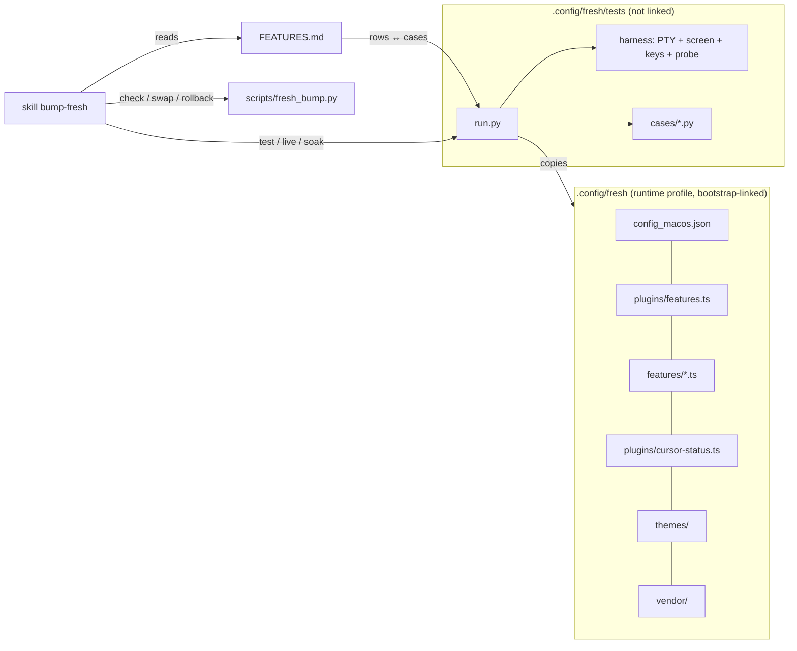
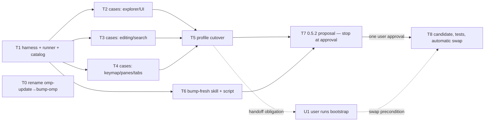

# Fresh maintenance: profile, test framework, bump skills, 0.5.2 bump — technical specification

**Revision:** `fresh-maintenance/spec-v8`
**Date:** 2026-09-30
**Baseline:** `HEAD` `3c7362e`; Fresh tree clean; installed `~/.local/bin/fresh` = freshog copy = `fresh 0.5.1`; upstream target `sinelaw/fresh` `v0.5.2`
**Next owner:** `dev-ticketing` (receiver: Main)

## 1. Authority

- Engineering Requirements Brief **CONFIRMED r2** (`local://fresh-requirements-draft.md`, relayed by Main 2026-09-30). It is binding; this spec cites its items as A1–A10 and does not restate them.
- Open questions the brief assigned to this spec are answered in §2.2 with evidence.
- One pre-listed question needs the user's approval in this spec: bump-omp scope (§4.6, D9). Default if not answered: rename only.
- Approvals that stay with the user: each bump proposal (before any install, edit or swap); deleting data outside the repo (none is planned); commits.

## 2. Current system and evidence

### 2.1 Repository facts (baseline `3c7362e`)

- `.config/fresh/`: `config.json` (195 lines, JSONC, 115-line `keybindings` list), `init.ts` (1,230 lines, 13 feature areas in one file), `plugins/cursor-status.ts` (62 lines), `themes/cursor-dark.json`, `vendor/unicode-segmenter-0.17.3/`, `maintenance/` (`UPDATE.md` 112 lines, `check.py` 715, `cases.py` 878, `probe.ts` 115, `requirements.txt`, `inactive-native/`).
- `UPDATE.md` inventory has **21** rows (L29–L49), not 20 as the brief says. The extra row is `bin/freshog` isolation (L49). The catalog below covers all 21 plus the brief's two additions.
- Bootstrap (`.config/scripts/bootstrap` L39–L43) links five Fresh paths one by one (`config.json`, `init.ts`, `themes/cursor-dark.json`, `plugins/cursor-status.ts`, the vendor directory) and creates the parent dirs (L90–L93). `~/.agents` → `.config/agents`, so a renamed skill directory resolves as a skill with no install step.
- The status bar references the plugin by file name: `{cursor-status:cursor_total}` (`config.json` L23). Keybindings call handler names registered in `init.ts` (for example `reopenClosedTab`).
- `omp-update` active references (`git grep`): its own `SKILL.md` L2 and L12, `harnesses/omp/acp-controller/cli.mjs` L174, `acp-controller/lib/versions.mjs` L2–L3. Everything else is under `.agents/artifacts/` and `.agents/plans/`, which are historical records.
- The working tree has unrelated uncommitted edits (the user's), including `acp-controller/cli.mjs`. A rename edit there must change only line 174.
- Tooling: `uv` 0.11.8 at `~/.local/bin/uv`, `python3` 3.14, `bun` 1.3.14, `gh`. `pexpect`/`pyte` are not installed system-wide.
- Plugin loading, observed on installed 0.5.1 in an isolated HOME:
  - A `plugins/*.ts` file can import a module from a sibling config directory (`../lib/a.ts`).
  - `init.ts` cannot import: the log says `Buffer plugin 'init.ts' has ES imports which cannot be resolved … Stripping them`.
  - A keybinding action reaches a handler that a `plugins/` file registers with `registerHandler` + `registerCommand` (same result as from `init.ts`).
- Fresh's package manager installs plugins into `<config>/plugins/packages/` (v0.5.2 `app/editor_init.rs` L179–L195), as it already did for `themes/packages/` live. So neither `plugins/` nor `themes/` can be a directory link without Fresh writing into the repo.
- Bootstrap has a `LEGACY_SYMLINKS` list (L47–L52, L118–L125) that removes a retired link only when it still points at its repo source.

### 2.2 Answers to the brief's open questions (evidence)

**Q1 — user-platform layer (`config_macos.json`).** Verified on installed 0.5.1 in an isolated HOME (`/tmp/fspec.2s2K`, `fresh --cmd config show`), and confirmed in v0.5.2 source:

- 0.5.1 loads `$HOME/.config/fresh/config_macos.json`. Its scalars override `config.json` (`line_wrap` true over false). Keys it omits come from `config.json` (`tab_size` 3). JSONC comments and trailing commas parse.
- Its `keybindings` list **replaces** the `config.json` list (only the platform binding survived; the user-layer binding disappeared).
- v0.5.2: the resolve order is Session > Project > UserPlatform > User > System (`crates/fresh-editor-core/src/config_io.rs` L443–470 at `v0.5.2`). The platform file sits in the same config dir (L499–515) and parses as a full `PartialConfig` (keybindings, keybinding maps, theme, languages, lsp, plugins). `layer_write_path` covers only User, Project and Session (L566–575), so no save or toggle path writes it. Writes to `config.json` are comment-preserving CST edits (L164–265). This matches the live evidence: live `config.json` is a regular file whose only difference is `line_wrap: true`, with all 29 comment lines intact.
- A palette toggle in 0.5.1 left both files byte-identical.
- On macOS, `XDG_CONFIG_HOME` is ignored. The config dir is `$HOME/.config/fresh` and data is `$HOME/Library/Application Support/fresh` (`config_io.rs` L914–918, L1059–1065), so only HOME isolation isolates config and data.
- **Decision:** the layer exists and is never written, so repo settings move there (D2). Toggle shadowing is accepted as the intended consequence of "repo-owned settings always win":
  - A toggle or Settings-UI save of a repo-pinned key lands in `config.json` and is overridden by the platform layer on the next resolve.
  - Per-buffer runtime toggles (for example Alt+Z) still work for the session.
  - The live-config check (§4.3) reports shadowed user-layer keys so the user can discard them.

**Q2 — daemon/orchestrator and the swap.** From v0.5.2 source:

- A bare `fresh` (no args, TTY stdin, `FRESH_SESSION` unset, `orchestrator_mode` true) is a thin client of one shared `orchestrator` daemon. The daemon is started via `current_exe()` + `setsid` and outlives the terminal (`main.rs` L5346–5390, `server/daemon/unix.rs` L66–116).
- Sockets and the pid file live in `$XDG_RUNTIME_DIR/fresh/`, otherwise `/tmp/fresh-$UID` (`server/ipc/platform_unix.rs` L10–27). `TMPDIR` is not used.
- The attach handshake compares only `PROTOCOL_VERSION`, which is 4 at both tags (`server/protocol.rs` L20, `editor_server.rs` L1010–1028). **After a binary swap, a 0.5.2 client silently attaches to a still-running 0.5.1 daemon.**
- 0.5.1 already runs a per-workspace daemon (observed: `fresh --cmd daemon list` → `local-<pid>-<hash>`). The live socket dir `/tmp/fresh-501` exists.
- **Decisions:**
  - The swap requires that no live Fresh client or daemon is running. It refuses and leaves the live install untouched otherwise, and never kills (D7).
  - Daemon liveness is probed read-only. `fresh --cmd daemon list` is not used outside isolated case envs, because it deletes stale socket files in the runtime dir while listing (observed by T6: `Cleaned up 21 stale daemon(s)` in `/tmp/fresh-501`).
  - Every test launch sets a private `XDG_RUNTIME_DIR` and passes explicit file args, so the orchestrator never starts in tests (D5).
  - freshog already sets HOME and `XDG_RUNTIME_DIR` (`bin/freshog` L6–13), so its sockets stay private under 0.5.2. Whether it should also clear an inherited `FRESH_SESSION`/`FRESH_CMD_TOKEN` is an adapt item for the 0.5.2 proposal, decided by its case result, not here.

**Q3 — bump-omp and the shared proposal format.** `omp-update` qualifies a pin with an offline suite and three user-run live runs. It has no evaluate-and-propose phase to share. Adding one would change its procedure, which the brief keeps unchanged by default. **Proposal (D9, needs user approval): rename only.** The shared element is the name family `bump-<tool>`. `bump-fresh` alone owns the sectioned proposal.

### 2.3 Defect reproduction (E1, E2)

- **E1 reproduced in isolation.** Setup: a copy of the repo profile in a temp HOME, installed 0.5.1, opened in `~/.dotfiles`, `ulimit -n 256` (the launchd soft limit).
  - The log shows `Plugin: File icon watcher: Error: watchPath(/Users/kim/.dotfiles): Too many open files (os error 24)` within 20 s.
  - `lsof` 18 s after launch: **252 fds held with `init.ts`, 37 with `--no-init`**. The recursive `watchPath` (`init.ts` L310) exhausts the limit and keeps the descriptors after its promise rejects. Every later open then fails; the live `fresh-49146.log` (475 MB) has 152,841 `Auto-recovery-save error … (os error 24)` lines.
  - The repo working tree was unchanged by the run.
- **E2.** `plugins/cursor-status.ts` L37 and L41 await buffer reads with no catch. The live log shows `Unhandled Promise rejection` from repo code. The rejection happens when the buffer or split closes mid-read.
- Live-log failure strings used by AC-1: `os error 24`, `Auto-recovery-save error`, `Failed to save workspace`, `Failed to save file state`, `failed to spawn`, `Failed to end recovery session`.

### 2.4 Upstream facts the design relies on (v0.5.2, `crates/fresh-editor/plugins/lib/fresh.d.ts`)

- `removePath`/`renamePath`/`copyPath` are removed; `writeFile` refuses existing paths; `replaceFile` overwrites.
- Present at both tags: `readFile`, `writeFile`, `setTimeout`, `getAllCursors`, `listSplits`, `describeWorkspace`, `flush`, `executeAction`, `watchPath(path, recursive?)`, and `unwatchPath`. A non-recursive watch covers the path plus its direct children.
- There is no general plugin undo-grouping API; the only grouped edit is `replaceInFile`, which saves.
- `fresh --cmd script run` / `command run` exist at both tags but need an editor-minted capability token (0.5.1 observed: `no capability token: script evaluation is not authorized`). No command injects keys or dumps the screen.
- 0.5.1 requests kitty keyboard flags 5 (`ESC[>5u` observed), so the PTY harness sends CSI-u sequences for modified keys.
- macOS arm64 asset: `fresh-editor-aarch64-apple-darwin.tar.xz` plus `.sha256`; the release is marked immutable.
- PR #3244 (native duplication carets) is **open, unmerged** (`gh api repos/sinelaw/fresh/pulls/3244`).

## 3. Architecture and ownership



Dependency direction: the skill depends on the runner and the catalog. The runner depends on the catalog and the profile. The profile depends on nothing in `tests/`. The probe plugin is test-only: it is injected into the per-case profile copy and never exists in the repo profile.

### 3.1 Refined profile layout (D1–D4)

Bootstrap links a fixed set of six Fresh paths. Adding or retiring a feature never changes that set.

| Path (repo `.config/fresh/`) | Role | Bootstrap link |
|---|---|---|
| `config_macos.json` | All repo-owned settings and the full keybinding list (moved from `config.json`, `editor.line_wrap: true`) | file (new) |
| `plugins/features.ts` | Entry plugin: `getEditor()` once, then imports each feature module | file (new) |
| `features/<feature>.ts` | One module per workaround feature group (table below) | directory (new) |
| `plugins/cursor-status.ts` | Kept as its own plugin, because the status-bar key `{cursor-status:…}` is the plugin name | file (unchanged) |
| `themes/cursor-dark.json`, `vendor/unicode-segmenter-0.17.3/` | Unchanged | unchanged |
| `FEATURES.md` | Catalog | no |
| `tests/` | Runner, harness, cases | no |
| ~~`config.json`~~, ~~`init.ts`~~, ~~`maintenance/`~~ | Removed from the repo. Their links move to bootstrap `LEGACY_SYMLINKS` | legacy |

- **D1 — split `init.ts` into feature modules behind one entry plugin.**
  - Why modules: each catalog row gets one implementation location. Retiring a feature means deleting one module file and its import line, plus its bindings, case and row.
  - Why one entry plugin and one directory link: linking each plugin file separately adds a bootstrap line per feature. Every retirement would then also need a legacy-link entry, and the swap would need to create links. The fixed link set avoids all of that. `features/` is not a directory Fresh writes to, so it can be linked as a directory; `plugins/` cannot (§2.1).
  - Cost: a module that throws while loading disables the others in the entry plugin. Today's single `init.ts` behaves the same way, and the harness log guard catches it.
  - Grouping, which follows the shared state in today's code:

    | Module (`features/`) | Features |
    |---|---|
    | `explorer-focus.ts` | macros `n`/`p` |
    | `boundary-selection.ts` | boundary selection clearing |
    | `explorer-icons.ts` | explorer icons |
    | `reopen-closed-tab.ts` | reopen closed tab |
    | `terminal-focus.ts` | terminal focus |
    | `search-highlights.ts` | `CUSTOM_HIGHLIGHTS`, the config-dir watcher, search stepping, cleared-search, select-all-occurrences, multi-cursor grey (these share paint state) |
    | `markdown-preview.ts` | unsaved Markdown preview |
    | `tab-move.ts` | directional tab moves |
    | `pane-layout.ts` | grow, shrink, equalize |
    | `line-edits.ts` | comment-preserve and duplicate-lines, which share the UTF-8 helpers |
    | (stays `plugins/cursor-status.ts`) | cursor status |

  - Handler and command names stay unchanged, so bindings do not move. Evidence that a key reaches a handler registered this way is in §2.1.
  - Modules export a function taking `editor`; they do not call `getEditor()` themselves.
- **D2 — settings layer.** `config_macos.json` is the only repo settings file and holds the entire keybinding list, because lists replace across layers.
  - Live `config.json` becomes Fresh-owned user-layer state. It is neither linked nor deleted: the existing live regular file stays in place, shadowed.
  - The live check reports its keys (§4.3). Discarding it is the user's call, since it is data outside the repo.
- **D3 — watcher fix (E1).** No recursive `watchPath` anywhere in the profile.
  - Explorer icon slots are recomputed with the existing bounded, coalesced traversal (depth 12, 8,000 entries, skip list) on `editor_initialized`, `after_file_explorer_change` and `after_file_save`.
  - External creates (narrowing accepted by the user after code review CR-1). On 0.5.1 no plugin-observable signal fires on the native explorer refresh, so a refresh cannot trigger a recompute; this is raised in §9. Coverage is:
    - a non-recursive watch on the workspace root, so root-level external creates get glyphs immediately;
    - Save As and in-editor creates get glyphs via `after_file_save`/`after_file_explorer_change`;
    - an external create below the root's direct children gets its glyph on the next explorer-change or save event, not immediately. No polling or other workaround is added.
  - Invariants: total repo-plugin watches ≤ 2 (the root plus the config dir), none recursive; the process holds ≤ 128 fds under `ulimit -n 256` in `~/.dotfiles` (AC-1).
  - Limit of the fix: E1 is fixed on 0.5.1 only up to the upstream notify 8.2 kqueue fd retention (notify-rs/notify#644, §9). On 0.5.1 our root watch can still trigger it, and on 0.5.2 Fresh's own native root watch can too. A resulting `explorer_icons` E1 failure is a catalogued known intermittent failure (§3.3), not a repo defect. No workaround.
- **D4 — cursor-status (E2).** Every awaited editor call in plugin handlers that can race a buffer or split close is guarded. A read that fails because its target vanished ends the handler quietly, with no status update. This applies to the whole profile, not only `cursor-status`: the harness log guard (§4.2) fails any case that logs an unhandled rejection.
- The Ghostty tree (`.config/ghostty/fresh/keybinds.ghostty`) is unchanged unless a retirement removes a binding family. Include order after `tode/` is preserved.
- Review Shift+Tab (user decision after code review CR-2): the repo's `review_focus_prev` Shift+Tab bindings (`when: mode:review-mode`/`mode:review-diff`) are removed now. On 0.5.1 they are inert, and native Shift+Tab already reverses focus. The `review-diff` row (`native`) keeps reverse focus as native behavior, guarded by the direction-sensitive `review_diff` case.
- `bin/freshog` is unchanged in this work outside a bump adaptation.

### 3.2 Test framework (D5, D6)

- **Language/runtime:** Python ≥3.12, one PEP 723 script `tests/run.py` run as `uv run --script .config/fresh/tests/run.py …`.
  - Pinned inline dependency: `pyte==0.8.2`, a pure-Python VT screen, with its `wcwidth`.
  - PTY via stdlib `pty`/`termios` (the harness shape was proven on 0.5.1 during this spec).
  - No `pexpect`, no hard-coded interpreter or Homebrew path.
  - If `uv` or the dependency is unavailable, the runner exits 2 and every row is reported `unrun`.
- **Layout:**

  ```text
  .config/fresh/tests/
    run.py            # CLI: test | drift | live | soak
    harness/          # session.py (isolation, PTY, pyte, teardown), keys.py (CSI-u/SGR mouse encoder), probe.ts (template), catalog.py (FEATURES.md parser)
    cases/<case_id>.py  # one per catalog row; exports CASE_ID, REQUIRES (tools), run(s)
    fixtures/         # small static inputs shared by cases
  ```

- **Isolation (per case):**
  - A new `mktemp` root with its own HOME, XDG_{CONFIG,DATA,STATE,CACHE,RUNTIME}_DIR and TMPDIR (dirs 0700).
  - Environment scrubbed of `FRESH_*`, `GIT_*` and `DYLD_*`; `GIT_CONFIG_GLOBAL=/dev/null`; `SHELL=/bin/sh`; `TERM=xterm-256color`; 120×40.
  - The workspace is a disposable git repo with no remote. The profile is **copied** from `--profile` into `$HOME/.config/fresh`, and the probe is injected as `plugins/zz-test-probe.ts`.
  - Launch: `<binary> --no-upgrade-check <files…>`. File args always, so no orchestrator and no telemetry.
  - Teardown: `<binary> --cmd daemon kill --all` in the case env, then SIGTERM/SIGKILL of the process group. The root is kept only with `--keep`.
  - Guards:
    - Refuse a `--profile` under the real `~/.config/fresh`.
    - Record the sha256 of `--binary` and the lstat map of the real `~/.config/fresh` before and after the run. A mismatch is reported as `isolation: FAIL` with exit 1.
- **How a case asserts** (the helpers on `s`):
  - Keys: `s.keys("super+shift+t")`, chord lists, `s.type("text")`, `s.mouse(click|release, col, row)`. The encoder produces kitty CSI-u bytes for modified keys and plain UTF-8 for text.
  - Saved bytes: `s.read_bytes(path)` after a save.
  - Cursor/selection/mode/buffers/splits: `s.state()` returns the probe snapshot: text, primary and all cursors with selections, active buffer and split, `listSplits`/`describeWorkspace` geometry, and view mode.
  - Rendered cells: `s.screen()` returns the pyte grid, and `s.cell(x, y)` returns its char, fg and bg (highlight colors, glyphs, status-bar text, pane borders).
  - Cursor shape: pyte drops DECSCUSR (`CSI <n> SP q`), so `session.pump` records the parameter of the last DECSCUSR seen in the raw PTY bytes, and `s.cursor_style()` returns it (for example `5` for a blinking bar).
  - Every wait is a bounded poll on a predicate (default 5 s). Fixed sleeps are allowed only for key-release timing.
  - The log guard fails any case whose Fresh log contains `Unhandled Promise rejection`, `os error 24`, or an `ERROR … Plugin:` line. There is one exception: a rejection whose message matches a signature listed under `## Upstream limitations` → `Log-guard signatures` in `FEATURES.md`.
    - Such a rejection does not fail the case. The runner prints `NOTE <row> <case> upstream rejection: <signature>`.
    - Listing a signature requires evidence that it comes from upstream code, not from the repo profile.
    - Signatures are exact message substrings. They are not generic patterns, and no repo-plugin message may be listed.
    - This classifies the upstream bug and raises it to the user; it is not a workaround. The editor behavior is not changed and nothing is suppressed in Fresh.
- **Probe (D6):** the test-only plugin polls `req-<n>.json` every 50 ms via `setTimeout`, after the harness writes it atomically. It answers with `writeFile(resp-<n>.json)` to a new path per request, so it needs neither `renamePath` nor `replaceFile`. It uses only APIs present at both tags (§2.4). This replaces `--cmd script run`, which needs a capability token that tests cannot mint.
- **Runner CLI:**
  - `test --binary B --profile P [--case ID]… [--json OUT] [--keep]` runs `drift`, then the selected cases (default all) sequentially, then prints the `live` report as information.
    - Per row it prints one of: `PASS <row> <case> <secs>`, `FAIL <row> <case> <first failed assertion>`, `UNRUN <row> <case> <reason>`, `LIMIT <row> <case> still blocked`, or `LIFTED <row> <case> desired behavior now passes`.
    - Final line: `summary: pass=… fail=… unrun=… limit=… lifted=… drift=… isolation=ok|FAIL`. With `--json OUT`, each case result carries its first failure message as `detail` (empty on PASS) plus `upstream_notes`.
    - Exit 0 iff fail=0, unrun=0, drift=0 and isolation ok; 2 for invalid invocation or a global prerequisite missing; else 1. The runner applies no tolerance: known intermittent failures (§3.3) are tolerated only by their consumers (AC-4 inspection and `fresh_bump.py`'s swap precondition, §4.4).
    - `upstream-limitation` rows run their case and are reported as `LIMIT`/`LIFTED`; they never change the exit code.
    - A per-case prerequisite (for example `basedpyright-langserver`, `prettier`) is resolved from PATH before isolation. If it is missing, the result is `UNRUN`.
  - `drift [--catalog F]` exits 1 on any mismatch and prints one `DRIFT …` line per problem, else `drift: rows=N cases=N ok`. Problems are:
    - a row without an existing case;
    - a case without exactly one row;
    - a duplicate ID;
    - a status outside `native|workaround|upstream-limitation`;
    - an `upstream-limitation` row missing from the `## Upstream limitations` section;
    - a runtime profile file (outside `tests/`, `FEATURES.md`) not covered by a bootstrap Fresh link, either its own or its directory's; a bootstrap Fresh link whose source is missing; a `features/*.ts` module that `plugins/features.ts` does not import.
  - `live [--home H] [--repo R]` is read-only. It reads the defaults `$HOME` and `~/.dotfiles` and checks the live Fresh link map against bootstrap's list.
    - Exit 1 with `LIVE <path>: not a symlink to <repo path>` or `LIVE <path>: differs from repo` when a repo-owned link is missing, replaced or diverges.
    - Exit 1 with `LIVE <path>: legacy link still present` for a Fresh `LEGACY_SYMLINKS` target that still points at its repo source. This is what still needs the user's bootstrap run (U1, §5).
    - Always lists `USER-LAYER <key> = <value> (shadowed|effective)` for each key in live `config.json`.
  - `soak --binary B --profile P --workspace W --minutes M` runs one isolated session in W under `ulimit -n 256`. It opens W as a directory arg, types into an unsaved scratch buffer every 30 s (auto-recovery), opens the file finder every 60 s (spawns `git ls-files`), samples `lsof` fd count every 30 s, and quits normally (workspace save).
    - It prints `soak: minutes=M emfile=… recovery=… workspace=… spawn=… rejections=… fds_peak=…`. `rejections` counts the rejections the log guard would fail. A catalogued upstream signature is counted separately in a following line, `soak-upstream: <signature>=<n>…`.
    - Exit 0 iff every count is 0 and fds_peak ≤ 128.
  - **Runtime:** target ≤ 30 s per case, about 25 rows, so ≤ 12 min per full `test` `[INFERENCE]`. Soak is outside `test`.

### 3.3 Catalog `FEATURES.md` (A3, A5)

- One GFM table, columns `ID | Behavior | Implementation | Case | Status`. The Behavior cells carry UPDATE.md's required behavior and retirement condition in one or two sentences.
- A `## Upstream limitations` section follows, with one bullet per limitation: `- <row-id>: <why> — evidence <link>`. It also holds:
  - retirement blockers, such as #3244 for a `workaround` row;
  - third-party limitations that narrow a row's case, such as Prettier for `comment-json-save`;
  - a `### Log-guard signatures` list, one bullet per signature: `- \`<exact substring>\`: <origin> — evidence <link or source path>`. Initial entries:
    - `unknown baseline id`
    - `baseline released during load`
    - Origin for both: Fresh's plugin off-loop runtime (`plugin_offloop.rs` strings in the 0.5.1 binary). No repo code uses baseline APIs.
    - Observed in about 2 of 9 `reopen_closed_tab` runs when diff/review views close right after opening, and from bundled git plugins after a commit.
  - a `### Known intermittent failures` list (user decision, spec-v7), with entries in exactly this form: `- \`<case_id>\`: \`<exact first-failure message prefix>\` — <row-id>`. One explanatory sentence precedes the entries.
    - Each entry is for a diagnosed upstream intermittent bug (causes in §9).
    - At most one entry per case.
    - `drift` validates the entries. It reports a missing case, a missing row, a duplicate case entry and a malformed line, and it does not count the subsection as rows.
    - bump-fresh rechecks the entries on each bump. A lift needs the named solo runs; one passing full run lifts nothing.
    - Initial entries (prefixes verbatim from the runner's FAIL lines):
      - `search_selection`: `timed out after 5s waiting for first match yellow, second grey` — search-selection
      - `interaction_highlights`: `search: current match yellow #FAFD54, others #DCDCDC on #656565` — search-selection
      - `file_chords`: `timed out after 5s waiting for q to return from the diff to notes.md` — file-chords
      - `explorer_icons`: `E1: no 'os error 24' in a 2,000-entry tree under ulimit -n 256` — explorer-icons
    - The timeout prefixes embed the default `5s` wait, so changing that default requires updating the entries.
- Initial rows (UPDATE.md line → ID → case → status):

| UPDATE.md | ID | Case | Status |
|---|---|---|---|
| L29 Presentation and startup | `presentation` | `presentation` | native |
| L30 Shared interaction highlights | `interaction-highlights` | `interaction_highlights` | workaround |
| L31 Native keymap preferences | `native-keymap` | `native_keymap` | native |
| L32 Document navigation/selection | `document-navigation` | `document_navigation` | native |
| L33 Boundary selection clearing | `boundary-selection` | `boundary_selection` | workaround |
| L34 Explorer icons | `explorer-icons` | `explorer_icons` | workaround |
| L35 Preview tabs | `preview-tabs` | `preview_tabs` | native |
| L36 Explorer-to-editor focus | `explorer-focus` | `explorer_focus` | workaround |
| L37 File commands and Markdown chords | `file-chords` | `file_chords` | native |
| L38 Reopen closed file | `reopen-closed-tab` | `reopen_closed_tab` | workaround |
| L39 Terminal focus and shortcut separation | `terminal-focus` | `terminal_focus` | workaround |
| L40 Search and multi-selection | `search-selection` | `search_selection` | workaround |
| L41 Unsaved Markdown preview | `markdown-preview` | `markdown_preview` | workaround |
| L42 Directional tab movement | `tab-move` | `tab_move` | workaround |
| L43 Editor resizing/equalization | `pane-layout` | `pane_layout` | workaround |
| L44 Duplication | `duplicate-lines` | `duplicate_lines` | workaround |
| L45 Comment/save behavior | `comment-json-save` | `comment_json_save` | workaround |
| L46 Python/navigation and file detection | `python-nav` | `python_nav` | native |
| L47 Cursor status/vendor | `cursor-status` | `cursor_status` | workaround |
| L48 Review/diff (without wrap) | `review-diff` | `review_diff` | native |
| L49 Isolated upstream comparison | `freshog-isolation` | `freshog_isolation` | workaround |
| brief: `file_browser.show_hidden` | `file-browser-hidden` | `file_browser_hidden` | native |
| brief: `line_wrap` | `line-wrap-default` | `line_wrap_default` | native |
| L48 wrap boundary (split out) | `diff-view-wrap` | `diff_view_wrap` | upstream-limitation |
| L44 multi-copy undo (split out) | `dup-multicopy-undo` | `dup_multicopy_undo` | upstream-limitation |

- Status meanings:
  - `native`: stock Fresh config or behavior, no repo code.
  - `workaround`: repo code compensates for missing upstream behavior.
  - `upstream-limitation`: the desired behavior is blocked upstream; no workaround is built, and the case asserts the desired behavior and is expected to fail.
- The `explorer_icons` case also carries the E1 regression: a 2,000-entry fixture tree under `ulimit -n 256`, then 0 `os error 24` and a successful save. The `cursor_status` case carries A2: it closes buffers and terminals during repeated cursor movement, then expects 0 `Unhandled Promise rejection`.

## 4. Interfaces, data, invariants, errors

### 4.1 Invariants

- I1: Nothing in `tests/` or the skill script writes under the real HOME's Fresh config/data/state, `~/.local/bin/fresh`, `/tmp/fresh-$UID`, or `~/.local/share/fresh-maintenance`. The only exceptions are `fresh_bump.py swap`/`rollback` (§4.4).
- I2: A case that cannot run is `UNRUN`, never `PASS`. A failure before an assertion leaves that assertion unproved.
- I3: The catalog and cases are in 1:1 correspondence (enforced by `drift`).
- I4: The repo profile holds no test code; the probe exists only in per-case copies.
- I5: Retiring a feature removes its plugin file (or its code), its bindings, its case and its row, and changes it to native with a native case where behavior continues. No alias or fallback.

### 4.2 Harness error behavior

- A probe timeout, a PTY EOF or an unparsable response fails the case with the reason.
- A teardown failure (a surviving pid in the case process group, or a leftover socket in the case runtime dir) fails that case.
- A drift problem or isolation mismatch is reported and forces exit 1. The cases still run, so the report stays complete.

### 4.3 Live-config check semantics (A6)

- Repo-owned live paths are the six bootstrap Fresh links (§3.1).
- Each must be a symlink resolving to the repo path, else `LIVE … not a symlink`. A symlink to another target, or a regular file with different bytes, is `LIVE … differs`.
- Live `config.json` is user-layer state. It is reported key by key as `shadowed` (also set by `config_macos.json`) or `effective`, and is never an error by itself.
- Resolution is the user's choice between copying a key into the repo or discarding it. The check never modifies anything.

### 4.4 `bump-fresh` skill (D7, D8)

Files: `.config/agents/skills/bump-fresh/SKILL.md` and `scripts/fresh_bump.py` (Python stdlib; subcommands `check`, `swap`, `rollback`, `proposal-check`). Description: use only when the user explicitly asks to check, update, upgrade or bump Fresh.

Phases:

1. **Check.** `fresh_bump.py check` runs `~/.local/bin/fresh --version` locally and exactly one read-only `gh release view --repo sinelaw/fresh --json tagName,publishedAt,url`.
   - Not newer: it prints exactly `Fresh up to date (v<X>)`, exits 0, writes nothing, and the skill stops.
   - Newer: it prints `Fresh update available v<X> -> v<Y>` and exits 10.
   - A query failure exits 1 with the reason.
2. **Evaluate** (read-only). Read `FEATURES.md`, the release notes and the source diff between tags. Classify every row as **retire** (upstream covers it; evidence names the release item or the source at `v<Y>`), **adapt** (an API or behavior change touches it) or **keep**. Also collect:
   - features the release blocks;
   - new upstream defaults that change our behavior;
   - upstream limitations, including `LIMIT` rows that may lift;
   - `run.py live` findings.
3. **Propose.** Present in the packed-label grammar (`.config/agents/references/packed-label.md`) with H2 `## Fresh bump proposal` and these fields in order: **Versions**, **Retire**, **Adapt**, **Keep**, **Blocked**, **New defaults**, **Upstream limitations**, **Config drift**, **Candidate plan**, **Approval**.
   - Each child is one simple bullet: `- <row-id>: <one-line reason> (<evidence link>)`. Omit empty fields.
   - Before presenting, run `fresh_bump.py proposal-check --catalog .config/fresh/FEATURES.md <file>` on the text saved to a temp file outside the repo. Exit 0 means every row appears exactly once across Retire, Adapt and Keep, each with a link.
4. **Approval gate.** Nothing is downloaded, edited, installed or swapped before an explicit user approval of that proposal. Adjustments produce a revised proposal.
5. **Candidate.** In a new private dir `~/.local/share/fresh-bump/<old>-to-<new>-<UTC stamp>/`:
   - Download the release asset and verify it against the published `.sha256`.
   - Copy the repo profile to `candidate/profile/` and apply the approved adaptations and retirements there, including catalog rows and cases. The repo stays untouched: case and catalog edits are made in a candidate copy of `.config/fresh`.
   - Run `run.py test` on candidate binary + profile, then `run.py soak --minutes 30` on the candidate (A1).
   - Any `UNRUN`, drift, isolation failure, or `FAIL` not tolerated by the rule in step 6.1 stops the bump and reports it. The live install is untouched. Tolerated FAILs do not stop the bump; they are listed in the report under **Upstream limitations**.
   - The soak run stays strict: no tolerance.
6. **Swap.** Runs automatically after a full pass: `fresh_bump.py swap --record <dir> --candidate-bin … --candidate-profile … --repo ~/.dotfiles --live-bin ~/.local/bin/fresh --home ~`. Order:
   1. Preconditions. If any fails, refuse with exit 3 and change nothing:
      - no process running the live binary (`pgrep` on its path);
      - no live daemon: the read-only probe `lsof -U` finds no socket held open under `$XDG_RUNTIME_DIR/fresh`, or under `/tmp/fresh-<uid>` when `XDG_RUNTIME_DIR` is unset. The probe runs even when the live binary is running, so the refusal report names both findings;
      - the test result JSON is a pass or a tolerated pass, and its binary and profile hashes equal the candidate's. A tolerated pass needs all of: unrun=0, drift=0 and isolation ok; `summary.fail` equal to the number of FAIL case results; and every FAIL case listed under `### Known intermittent failures` in the **candidate profile's** `FEATURES.md`, with its `detail` starting with that entry's exact prefix. `swap` prints `TOLERATED <case>: <message>` for each tolerated FAIL, also on refusal, and stores them as `tolerated_failures` in `record.json`;
      - the repo Fresh paths have no uncommitted changes;
      - `run.py live` exits 0;
      - the candidate did not change bootstrap's Fresh link list. Otherwise the report says that bootstrap needs a user rerun first.
   2. Write the rollback pair into the record:
      - the old binary's bytes and sha256;
      - pre-bump bytes of every repo Fresh path the swap will change or delete;
      - a copy of `~/Library/Application Support/fresh` (6.2 MB today) and the live link map;
      - `record.json` with all hashes and the dotfiles revision.
   3. Apply: copy candidate profile files into the repo Fresh paths and remove the files the candidate removed. Write the new binary beside the live one and `mv` it into place. The swap never creates, changes or deletes links: the fixed link set (§3.1) already makes the new repo files live.
   4. Post-swap identity check: the live binary sha equals the candidate's; `--version` reports the target in an isolated HOME; the repo profile bytes equal the candidate's; `run.py live` exits 0.
   5. Any failure in steps 3–4 triggers automatic `rollback`, and the command exits 4. The result is byte-identical to pre-bump (A8).
   - The commit of the profile change is **not** part of the swap. It needs a separate shipping request. The report states the uncommitted paths.
   - `fresh_bump.py rollback --record <dir>` restores the binary via beside + `mv`, the repo paths' bytes, and removed files. It leaves session data alone unless given `--with-session-data`, and never overwrites newer work silently. Each restored path is printed.
7. **Report** in packed-label form: `## Fresh bump result`, with fields **Versions**, **Outcome** (`activated`, `blocked at <phase>` or `rolled back`), **Changes**, **Tests** (summary line + soak line), **Upstream limitations**, **Blocked**, **Rollback** (record path + command), **Uncommitted**.

### 4.5 Unchanged surfaces

- bump-fresh never runs bootstrap, `fresh --cmd update`, Homebrew or commits.
- It never deletes live data. Session-data restore is opt-in.
- Physical Ghostty checks are listed in the report as `unrun (physical surface)` for the user to do.

### 4.6 `omp-update` → `bump-omp` (A9, D9)

- `git mv`-equivalent rename of `.config/agents/skills/omp-update/` → `bump-omp/`: frontmatter `name: bump-omp`, H1 `# bump-omp`, with the procedure text otherwise byte-identical.
- Edit only `cli.mjs` L174 (`procedure: .config/agents/skills/bump-omp/SKILL.md`) and `versions.mjs` L2–L3 (skill name and path).
- `.agents/artifacts/**` and `.agents/plans/**` are historical and exempt (A9).
- No alias directory, no redirect text.

## 5. Effects, migration, rollback, compatibility

- **Repository effects (implementation, later):**
  - new `FEATURES.md`, `tests/`, `plugins/features.ts`, `features/*.ts`, `config_macos.json`;
  - deleted `config.json`, `init.ts`, `maintenance/` (including `UPDATE.md` and `inactive-native/`; Git history is the record);
  - edited `plugins/cursor-status.ts`; bootstrap `SYMLINKS` (L39–L43: add `config_macos.json`, `plugins/features.ts` and `features/`, remove `config.json` and `init.ts`), `LEGACY_SYMLINKS` (add the `config.json` and `init.ts` links) and the `mkdir` lines (L90–L93);
  - new skill, renamed skill, two acp-controller lines.
- **Live effects of the profile cutover.** Bootstrap owns the live Fresh links (brief constraint), and the brief allows no agent write to the live profile except the approved post-pass swap. So T5 changes the repo only. Until bootstrap runs, the live profile is inconsistent:
  - the live `init.ts` link dangles;
  - live `config.json` stays the stale regular file;
  - `config_macos.json`, `plugins/features.ts` and `features/` are not linked.
  - The running Fresh keeps its already-loaded profile. `[INFERENCE]` A restart before bootstrap runs loses the repo customizations.
- **U1 — post-cutover step, owned by the user.** Run `~/.dotfiles/.config/scripts/bootstrap` before the next Fresh restart. It creates the three new links and removes the legacy `init.ts` link. The legacy `config.json` entry only removes a link that still points at the repo; the live regular file is left as user-layer state.
  - Proof: `uv run --script ~/.dotfiles/.config/fresh/tests/run.py live` exits 0.
  - The T5 handoff names U1 as its only open obligation.
  - T7 reports any `LIVE` finding under **Config drift**, and swap precondition 1 blocks until U1 is done.
- **Non-repository effects in the bump run:** only those in §4.4 phases 5–6, after approval.
- **Rollback:**
  - The profile cutover is reversible via Git (`git checkout 3c7362e -- .config/fresh .config/scripts/bootstrap`) plus a bootstrap rerun.
  - A bump is reversed with `fresh_bump.py rollback`.
- **Compatibility:** 0.5.1 honors the platform layer, so D1–D4 land and pass on 0.5.1 before any bump (A4). The harness uses only APIs present at both tags.

## 6. Acceptance

Commands run from `~/.dotfiles`. `R=uv run --script .config/fresh/tests/run.py`. `B=~/.local/bin/fresh`.

**AC-1 (A1, installed)**
Behavior: a 30-min isolated session in `~/.dotfiles` on 0.5.1 with the refined profile has no fd exhaustion or save/spawn failure.
Check: `$R soak --binary $B --profile .config/fresh --workspace ~/.dotfiles --minutes 30`; expect exit 0 and a line matching `soak: minutes=30 emfile=0 recovery=0 workspace=0 spawn=0 rejections=0 fds_peak=<n≤128>`.

**AC-2 (A2)**
Behavior: closing buffers and terminals during cursor movement produces no unhandled rejection from repo plugins.
Check: `$R test --binary $B --profile .config/fresh --case cursor_status`; expect exit 0 and a line starting `PASS cursor-status cursor_status`.

**AC-3 (A3)**
Behavior: the catalog and cases correspond 1:1, and drift is caught in both directions.
Check: `$R drift`; expect exit 0 and `drift: rows=25 cases=25 ok`. Then `T=$(mktemp -d); cp -R .config/fresh/. $T/; rm $T/tests/cases/pane_layout.py; touch $T/tests/cases/orphan_x.py; uv run --script $T/tests/run.py drift --catalog $T/FEATURES.md`; expect exit 1 with lines `DRIFT row pane-layout: case pane_layout missing` and `DRIFT case orphan_x: no row`.

**AC-4 (A4, installed)**
Behavior: every non-limitation row passes on installed 0.5.1 with the repo profile, with no Homebrew, backup or live-link dependency. There is one exception, decided by the user: a single catalogued known intermittent failure (§3.3).
Check: `$R test --binary $B --profile .config/fresh --json <out>`. Expect `unrun=0`, `drift=0`, `isolation=ok` and l+k=2 in the final summary line, plus one of two outcomes:
- (a) exit 0 and a final line matching `summary: pass=23 fail=0 unrun=0 limit=<l> lifted=<k> drift=0 isolation=ok`;
- (b) exit 1 and a final line matching `summary: pass=22 fail=1 unrun=0 limit=<l> lifted=<k> drift=0 isolation=ok`. The single FAIL's case must be listed under `### Known intermittent failures` in `.config/fresh/FEATURES.md`, and its message must start with that entry's prefix. The message is the case's `detail` in `<out>`, or the text after `FAIL <row> <case> ` on the FAIL line.

Any other `FAIL`, or more than one `FAIL`, fails AC-4. Then `grep -rnE '/opt/homebrew|\.bak|fresh-maintenance|\.config/fresh/config\.json' .config/fresh/tests`; expect no output.

**AC-5 (A5)**
Behavior: every r1 inventory feature has a row.
Check: `for id in presentation interaction-highlights native-keymap document-navigation boundary-selection explorer-icons preview-tabs explorer-focus file-chords reopen-closed-tab terminal-focus search-selection markdown-preview tab-move pane-layout duplicate-lines comment-json-save python-nav cursor-status review-diff freshog-isolation file-browser-hidden line-wrap-default; do grep -c "^| \`$id\` |" .config/fresh/FEATURES.md; done | sort -u`; expect exactly `1`.

**AC-6 (A6)**
Behavior: the live-config check flags a replaced or diverging repo-owned live file and reports user-layer keys.
Check: build three sandboxes H1–H3 from a script in `mktemp -d`, each `$H/.config/fresh` holding the bootstrap link set pointing into the repo:
- H1: `config_macos.json` is a regular-file copy;
- H2: `config_macos.json` is a regular file with one changed byte, plus a `config.json` containing `{"editor":{"line_wrap":false}}`;
- H3: intact.

Run `$R live --home $H1`, `--home $H2`, `--home $H3`. Expect:
- H1: exit 1 with `LIVE config_macos.json: not a symlink to …`;
- H2: exit 1 with `LIVE config_macos.json: differs from repo` and `USER-LAYER editor.line_wrap = false (shadowed)`;
- H3: exit 0.

Also, `$R test …` output (AC-4 run) contains a `live:` section.

**AC-7 (A7, up-to-date path)**
Behavior: with nothing newer, the check makes one read-only query, prints one line and writes nothing.
Check: in `S=$(mktemp -d)`, put a `gh` shim on PATH that appends its argv to `$S/gh.log` and prints `{"tagName":"v0.5.1",…}`; set `HOME=$S/home`; `touch $S/m`; run `python3 .config/agents/skills/bump-fresh/scripts/fresh_bump.py check --live-bin $B`. Expect:
- stdout exactly `Fresh up to date (v0.5.1)` and exit 0;
- `wc -l < $S/gh.log` = `1`;
- `find $S ~/.dotfiles -newer $S/m -type f ! -path "$S/gh.log" ! -path '*/.git/*'` prints nothing.

**AC-8 (A8)**
Behavior: after a pass the swap installs binary + profile and records a restorable pair; any failure leaves the live install byte-identical.
Check: sandbox `S` with `S/live/fresh` (a copy of 0.5.1), `S/repo` (a `git clone` of `~/.dotfiles` at HEAD), a candidate profile with one changed plugin byte, and a pass-result JSON with matching hashes. Take pre-hashes with `find S/live S/repo/.config/fresh -type f | xargs shasum -a 256`. Expect each case:
- (a) `swap` exits 0; the live sha equals the candidate's; `record.json` exists.
- (b) `rollback --record` exits 0; the hashes equal the pre-hashes.
- (c) With the candidate binary `chmod -x`, `swap` exits 4 and the hashes equal the pre-hashes.
- (d) With `S/live/fresh` replaced by a running `sleep 60` wrapper at that path, `swap` exits 3 and the hashes equal the pre-hashes.
- (e) With a result JSON containing `fail=1` at a case the candidate catalog does not list, or at a listed case whose `detail` does not start with the entry's prefix, `swap` exits 3 and the hashes equal the pre-hashes. The same holds with `unrun=1` beside a tolerated FAIL.
- (f) With a result JSON whose only FAIL is a listed case whose `detail` starts with the entry's prefix, and with matching hashes, `swap` exits 0. It prints `TOLERATED <case>: <message>`, and `record.json` `tolerated_failures` lists that case.

**AC-9 (A9)**
Behavior: no active `omp-update` references remain, and `bump-omp` resolves.
Check: `git grep -n omp-update -- . ':!.agents/artifacts' ':!.agents/plans'`; expect no output. `grep -c '^name: bump-omp$' ~/.agents/skills/bump-omp/SKILL.md`; expect `1`. `test -e .config/agents/skills/omp-update; echo $?`; expect `1`.

**AC-10 (A10, bump run)**
Behavior: the 0.5.2 proposal classifies every row with evidence and lists limitations separately.
Check: `python3 .config/agents/skills/bump-fresh/scripts/fresh_bump.py proposal-check --catalog .config/fresh/FEATURES.md <saved proposal>`; expect exit 0 and `proposal: rows=25 classified=25 evidence=25`. The saved proposal is the agent's verbatim proposal text, written by the T7 owner to the session artifact `local://fresh-0.5.2-proposal.md`. The file contains an `**Upstream limitations**` field.

**AC-11 (A7 second half, bump run)**
Behavior: 0 installs, edits or swaps before approval.
Check: before and after presenting the proposal, run `shasum -a 256 $B; git status --porcelain -- .config/fresh; ls ~/.local/share/fresh-bump 2>&1`; expect identical output.

**AC-12 (isolation)**
Behavior: a full test run leaves the real Fresh install untouched.
Check: `ls -la ~/.config/fresh | shasum; shasum -a 256 $B` before and after the AC-4 run; expect identical output, and the AC-4 summary contains `isolation=ok`.

**AC-13 (cleanup)**
Behavior: superseded tooling is gone, and bootstrap retires the old Fresh links and creates the new ones.
Check: `test -e .config/fresh/maintenance; echo $?` → `1`; `bash -n .config/scripts/bootstrap; echo $?` → `0`; `$R drift` → exit 0 (includes the link-coverage check). Then run `$R live --home <sandbox>` twice:
- a sandbox holding only the legacy `init.ts`/`config.json` links into the repo: expect exit 1, with `LIVE init.ts: legacy link still present` and `LIVE config_macos.json: not a symlink …`;
- a sandbox holding exactly the six links: expect exit 0.

**AC-14 (A4/A8, candidate, bump run after approval)**
Behavior: the 0.5.2 candidate passes before any swap, except for catalogued known intermittent failures (user decision, spec-v7), and the swap records rollback.
Check: `$R test --binary <candidate>/bin/fresh --profile <candidate>/profile --json <candidate>/result.json`. Expect `unrun=0 drift=0 isolation=ok`, and either exit 0 with `fail=0`, or exit 1 where every FAIL is tolerated by the candidate profile's `FEATURES.md`. The soak like AC-1 on the candidate exits 0, with no tolerance. `fresh_bump.py swap …` exits 0, prints the record path and one `TOLERATED <case>: <message>` line per tolerated FAIL; `record.json` `tolerated_failures` lists exactly those cases. `~/.local/bin/fresh --version` → `fresh 0.5.2`.

## 7. Test seams

- **Public seams used:** the real binary through a PTY (keys in, cells out), saved files, the Fresh log, and `fresh --cmd config show|daemon list|daemon kill` inside the case env.
- **Test-only seam:** the probe plugin, injected only into per-case profile copies (I4). No production hook exists for tests.
- **Permanent tests.** The 25 cases, `drift`, `live` and `soak` make up the retained suite.
  - Every case asserts consumer-visible behavior through keys, rendered cells, saved bytes or probe state.
  - No case asserts config values, file contents of the profile, or source text. For example, `line_wrap_default` asserts that a long line renders wrapped, not that `line_wrap` is true. Ghostty unbinds are a physical surface: they are reported as `unrun (physical surface)`, not pinned by a text check.
  - The FEATURES↔cases contract is guarded by AC-3's negative run, not by a separate test file.
  - The `fresh_bump.py` sandbox checks (AC-7, AC-8) are acceptance scenarios. T6 keeps the swap-failure scenario (AC-8 c–e) as `tests/test_fresh_bump.py`, because it catches a consumer-visible bug: a partial install after a failed swap. It keeps no other script test.
- The old `check.py` suite is removed. Its 13 groups map onto the new cases. Their historical failures (`search-selection`, `file-chords`, `json-save` on 2026-09-10) are treated as possible product bugs when first rerun under the new cases (T2–T4), not as deletion evidence.

## 8. Implementation boundaries and dependencies

Sizing: about 25 PTY cases, a harness of roughly 600–900 lines, a 1,230-line decomposition, and a skill with a script. That exceeds one fresh context, so this is a lean plan of eight tasks at real seams. **Not too large in total** for the ticketed route. The case authoring (T2–T4) dominates, and splitting it three ways keeps each task within one context.



- **T0** rename (AC-9). Independent. Touches the dirty `cli.mjs` at L174 only.
- **T1** harness core, runner (`test|drift|live|soak`), key encoder, probe, log guard, isolation guards, and `FEATURES.md` with all 25 rows and the limitations section. It also writes one reference case (`line_wrap_default`) that proves the harness end to end.
  - Accept on AC-6, AC-12, and `drift` listing exactly the 24 missing cases.
  - `line_wrap_default` must `PASS` on 0.5.1 with a scratch profile containing `config_macos.json`. Against the repo profile it is expected to `FAIL` until T5.
- **T2–T4** are case authoring, split by feature group so each owner reads one area of `init.ts`/`config.json` and one area of UPDATE.md.
  - The split is at a real seam: cases are disjoint files, and each task is checked on its own with `$R test --binary $B --profile .config/fresh --case <its cases>`.
  - They depend on T1 only and run in parallel. Each writes against the **current** profile on 0.5.1, so the cases work as a characterization net for the T5 decomposition.
  - Each handoff gate is met by its own work:
    - its cases `PASS`, or `LIMIT` for limitation rows;
    - or `FAIL` for exactly the documented E1/E2 regressions, which T5 fixes:
      - E1: the fd/save assertion of `explorer_icons`;
      - E2: in any of the task's cases, a log-guard failure whose first failed assertion is the `cursor-status` rejection `Buffer BufferId(<n>) not found`. It must come from `refreshCursorStatus`, and every behavior assertion of the case must pass;
    - `drift` shows no missing case from its own set.
  - E2 surfaces outside `cursor_status` because the status plugin races every buffer close; the pre-cutover baseline confirmed this. After T5, AC-4 requires every case to pass, so this allowance ends at T5.
  - Any other baseline `FAIL` is reported as a possible product bug in the handoff, never weakened.
  - T2 also owns the additive harness and catalog changes from spec-v3. T3 and T4 do not edit these files.
    - `harness/session.py` records the last DECSCUSR and exposes `cursor_style()`, used by `presentation` for the blinking bar.
    - The log-guard signature exception and its `NOTE` line, in the harness/runner files that own the log guard, including the catalog parser for `### Log-guard signatures`. The subsection must not count as rows for `drift`.
    - The `soak-upstream` line.
    - The `FEATURES.md` `## Upstream limitations` additions: the two signatures, plus the Prettier and #3245-on-0.5.1 notes reported by T3/T4.
  - **T2** (explorer/UI): presentation, interaction-highlights, explorer-icons (incl. the E1 regression), preview-tabs, explorer-focus, file-browser-hidden, cursor-status (incl. A2), freshog-isolation.
  - **T3** (editing/search): boundary-selection, search-selection, markdown-preview, duplicate-lines, dup-multicopy-undo, comment-json-save, python-nav, document-navigation.
  - **T4** (keymap/panes/tabs): native-keymap, file-chords, reopen-closed-tab, terminal-focus, tab-move, pane-layout, review-diff, diff-view-wrap.
- **T5** profile cutover (D1–D4): `config_macos.json` with `line_wrap: true`, the entry plugin with feature modules, watcher and rejection fixes, bootstrap `SYMLINKS`/`LEGACY_SYMLINKS`/`mkdir` edits, the `FEATURES.md` implementation column, and deletion of `config.json`/`init.ts`/`maintenance/`.
  - Accept on AC-1, AC-2, AC-4, AC-5 and AC-13.
  - Repo-only: it makes no live-link changes. Its handoff names U1 (§5) as the user's open obligation.
- **T6** `bump-fresh` SKILL.md and `fresh_bump.py` (AC-7, AC-8). Depends on T1 for the runner CLI and result JSON only.
- **T7** first skill run, phases 1–4: the 0.5.1→0.5.2 proposal (AC-10, AC-11). It stops at the approval gate. **The user asked for this route to end here.**
- **T8** is the same skill run continuing after the user's one approval of the T7 proposal: phases 5–7 (AC-14; A8 on the real install).
  - There is no second approval: after a full pass the swap is automatic (brief Q5).
  - If U1 is not done, swap precondition 1 refuses the swap and the report says so.
  - T8 is outside this route's execution because the route stops at the proposal.

## 9. Upstream limitations raised

| Feature | Why | Proposed disposition |
|---|---|---|
| `diff-view-wrap` | Alt+Z has no effect in diff/review views in 0.5.1; v0.5.2 notes list no fix (only #3314 inlay hints) | Row `upstream-limitation`; its case reports `LIMIT`/`LIFTED`; no workaround |
| `dup-multicopy-undo` | Plugins have no general undo-grouping API (v0.5.2 d.ts: only `replaceInFile`, which saves), so multi-copy duplication cannot be one undo step | Row `upstream-limitation`; no workaround |
| `duplicate-lines` retirement | Native duplication carets fix PR #3244 is open and unmerged | Keep the workaround; record as a retirement blocker in the limitations section |
| notify kqueue fd retention (`explorer-icons`) | notify 8.2's kqueue backend holds about 1 fd per entry for a recursive watch and keeps them after an EMFILE rejection (notify-rs/notify#644; 252/256 fds observed; `local://diag-emfile.md`). 0.5.1 is triggered by our root watch, and 0.5.2 also by its native root watch | D3 removes our recursive watch. The remaining intermittent E1 failure is catalogued under Known intermittent failures and tolerated by AC-4/AC-14 (user decision, spec-v7). The soak stays strict. Raised; no workaround |
| Markdown-source mode race (`file-chords`) | Intermittent upstream race in `markdown_source` mode activation (`local://diag-file-chords.md`) | Catalogued under Known intermittent failures (user decision, spec-v7). Raised; no workaround |
| Harness surface | `--cmd script run` needs an editor-minted capability token; no key-injection or screen-dump command exists | Accepted: PTY + pyte + test-only probe; not a feature row |
| Daemon version check | Handshake compares only `PROTOCOL_VERSION` (4 at both tags), so a new client attaches to an old daemon | The swap precondition requires no live Fresh running (D7); no workaround |
| `daemon list` side effect | `fresh --cmd daemon list` deletes stale daemon socket files while listing (`Cleaned up 21 stale daemon(s)` in `/tmp/fresh-501`), so it is not a read-only query | Raised as an upstream note. Swap preconditions use the read-only `lsof -U` probe instead. `daemon list`/`daemon kill` are used only inside isolated case envs |
| Pinned-key toggles | Toggles and Settings UI write `config.json`, which the platform layer shadows | Intended by "repo wins"; the live check reports the shadowed keys |
| Upstream unhandled rejections | Fresh 0.5.1's plugin runtime intermittently logs unhandled rejections: `unknown baseline id N` and `baseline released during load` (`plugin_offloop.rs`). They appear when diff/review views close shortly after opening, and in bundled git plugins after a commit. No repo code is involved | Catalogued log-guard signature: reported as `NOTE`, never failing a case, and raised in T7. No workaround |
| Prettier trailing comma (`comment-json-save`) | Prettier drops the comma before a commented last JSON property, so uncommenting and then saving produces invalid JSON | Third-party limitation recorded under the row. The case asserts formatted save + kept comment only. Raised to the user; no workaround |
| Explorer refresh signal (`explorer-icons`) | On 0.5.1, no plugin-observable signal fires on the native explorer refresh: `pre_command`/`post_command` are declared in `fresh.d.ts` but never fire | Narrowing accepted by the user (CR-1). A deep external create gets its glyph on the next explorer-change or save event (D3). Raised to the user; no workaround |
| Inert plugin-mode bindings (`review-diff`) | On 0.5.1, user keybindings with `when: mode:review-mode`/`mode:review-diff` have no effect | The inert `review_focus_prev` Shift+Tab bindings are removed (CR-2); reverse focus is native. Raised as an upstream note; T7 evaluates it against #3253/#3060 |
| Current-match yellow (`search-selection`, `interaction-highlights`) | On Fresh 0.5.1, plugin overlays and native search matches share fixed priority 10. Draw order on that tie is unstable after `swap_remove`, and there is no theme key for the current match. As a result the plugin's yellow current-match overlay intermittently loses to the native match color (diagnosis: session artifact `local://diag-search.md`) | The user keeps the highlight as is and accepts the intermittent failure. It is recorded in `FEATURES.md` `## Upstream limitations` under both rows, and bump-fresh rechecks it on each bump. AC-4 tolerates exactly that one FAIL. No workaround |
| #3245 on 0.5.1 | Split-resize keys have no effect from a terminal pane on 0.5.1 | `terminal_focus` asserts key separation only; T7 evaluates the 0.5.2 fix |

The 0.5.2 proposal (T7) will add any further limitations found in the release evaluation. Expected evaluation items, not decisions:
- #3245 (split-resize shortcuts from a terminal pane) → `terminal-focus`/`pane-layout`;
- #3253 (panel Shift+Tab) → `review-diff`;
- #3060 (plugin-mode chords) → `file-chords`;
- case-folded search default (#3349) and persisted search history → `search-selection`;
- occurrence highlight and status-bar theming → `interaction-highlights`/`presentation`;
- Markdown compose fixes → `markdown-preview`;
- the orchestrator default and Ctrl+Q Detach/Quit dialog → **New defaults**;
- `FRESH_SESSION` inheritance → `freshog-isolation`;
- modal confirmations, `setInputMode` key resolution (#3395), list replacement → every binding row.

## 10. Risks, assumptions, stops

- **R1:** pyte may render Fresh's truecolor or wide glyphs differently from Ghostty. Cases compare against explicit RGB and cell width via pyte, and physical rendering stays out of scope (non-goal).
- **R2 (retired by evidence):** an action binding reaching a handler registered outside `init.ts` was verified on 0.5.1 (§2.1). Remaining risk: module-level state shared across the entry plugin. D1 grouping keeps each shared-state set inside one module.
- **R5:** until U1, a Fresh restart runs without the repo customizations (§5). The T5 handoff and the T7 **Config drift** field both surface this.
- **R6:** a log-guard signature could hide a repo-caused rejection with the same text. Signatures are exact, evidence-backed upstream strings. A signature observed in a stack or message from a repo file is a Stop.
- **R3:** kitty CSI-u delivery of `super` via PTY may differ from Ghostty. The native-keymap case proves Fresh's resolution only; physical Ghostty gestures remain `unrun (physical surface)`.
- **R4:** the soak needs 30 min per binary. AC-1 and AC-14 are long-running checks, not per-case.
- **Assumption:** freshog stays a stock-upstream launcher, and the swap covers `~/.local/bin/fresh` plus the matching repo profile paths (brief).
- **Stops** (return to this spec's owner):
  - a feature can only be kept by a new upstream-bug workaround (classify instead);
  - any check would need to write the real HOME outside §4.4;
  - a baseline case fails on 0.5.1 for a reason other than E1/E2;
  - the harness cannot observe a row's behavior through a PTY, probe or file (the row becomes `UNRUN`, and the user decides).

## 11. Decisions

| ID | Decision |
|---|---|
| D1 | Split `init.ts` into `features/*.ts` modules behind one `plugins/features.ts` entry; fixed six-link bootstrap set (§3.1) |
| D2 | All repo settings and keybindings in `config_macos.json`; `config.json` is Fresh-owned |
| D3 | No recursive watch; bounded icon refresh |
| D4 | Guard vanished-target awaits in all plugins |
| D5 | Python + uv + pyte PTY harness in `.config/fresh/tests/`, per-case HOME/XDG/TMPDIR/XDG_RUNTIME_DIR isolation, file-arg launches |
| D6 | Test-only file-channel probe plugin |
| D7 | Swap refuses while live Fresh runs (process check + read-only `lsof -U` socket probe); never kills. A test result is accepted only as a pass or a tolerated pass: every FAIL is listed in the candidate catalog with a matching message prefix, unrun=0, drift=0, isolation ok, and hashes match. Tolerance lives in `fresh_bump.py`, not the runner |
| D8 | Rollback records in `~/.local/share/fresh-bump/`; no commit in swap |
| D9 | bump-omp: rename only (**user approval requested**) |
| D10 | Live Fresh links stay bootstrap-owned. T5 is repo-only, and U1 (the user runs bootstrap) is a named post-cutover step gating the swap |

## 12. Revision

- `fresh-maintenance/spec-v1`: first candidate.
- `fresh-maintenance/spec-v2`: result of the single plan-rethink pass. Changes:
  - D1 now uses a fixed link set;
  - the live-link obligation U1 has an owner, with legacy-link retirement via bootstrap;
  - the test-value correction removes the Ghostty text check and keeps one fresh_bump test;
  - T2–T4 have self-contained gates;
  - the T7/T8 approval flow is clarified.
- `fresh-maintenance/spec-v3`: bounded correction after a characterization Stop.
  - The E2 allowance is extended to any T2–T4 case, with narrow conditions.
  - Catalogued upstream log-guard signatures report `NOTE` instead of failing.
  - DECSCUSR cursor-style observation is added to the harness.
  - Prettier and #3245 notes are added.
  - T2 targets now include harness/runner/catalog-parser and the `FEATURES.md` limitations section.
  - AC-1–AC-14 text is unchanged.
- `fresh-maintenance/spec-v4`: the swap daemon precondition (§4.4 step 6.1) uses the read-only `lsof -U` socket probe instead of `fresh --cmd daemon list`, whose stale-socket cleanup is recorded as an upstream note (§2.2, §9, D7). AC-1–AC-14 text is unchanged.
- `fresh-maintenance/spec-v5`: records two user decisions made after code review.
  - CR-1: the D3 external-create glyph narrowing is accepted, and the missing refresh signal is raised.
  - CR-2: the inert review Shift+Tab bindings are removed, and the inert-mode-binding note is raised.
  - AC-1–AC-14 text is unchanged.
- `fresh-maintenance/spec-v6`: user decision. The current-match yellow highlight is kept despite the diagnosed 0.5.1 overlay-priority bug, and is recorded as an upstream limitation (§9, `FEATURES.md`). **AC-4 text changed**: it tolerates exactly one `search_selection`/`interaction_highlights` FAIL at the current-match yellow assertion.
- `fresh-maintenance/spec-v7`: user decision "tolerate known".
  - A new `FEATURES.md` `### Known intermittent failures` list (yellow overlay, Markdown-source race, notify#644).
  - The runner prints `TOLERATED` lines and a `tolerated=` summary field; its exit code is unchanged.
  - The D7 swap precondition and phase 5 accept fail = tolerated, and `record.json` stores the tolerated entries. The soak stays strict.
  - D3's limit and the notify row are added to §9.
  - **AC text changed: AC-4, AC-8 (e reworded, f added), AC-14.**
- `fresh-maintenance/spec-v8`: aligns spec-v7's tolerance design with the landed T6 implementation (`local://handoff-T6-tol.md`).
  - The runner is unchanged (no `TOLERATED` lines, no `tolerated=` field); tolerance is applied in `fresh_bump.py` from the candidate catalog.
  - The entry grammar is `- \`<case_id>\`: \`<prefix>\` — <row-id>`, and drift validates it.
  - Plan-facing AC-4 (b), AC-8 (e, f) and AC-14 text is revised accordingly.
- The next owner is `dev-ticketing`.
