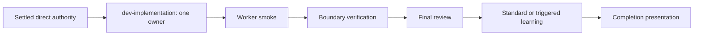
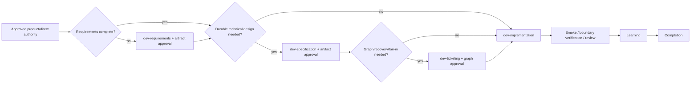
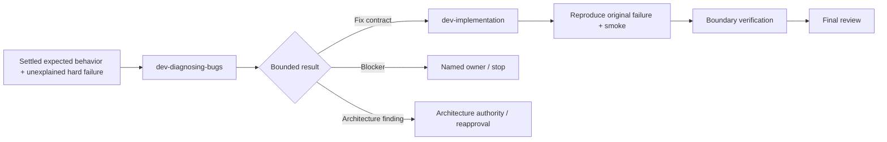
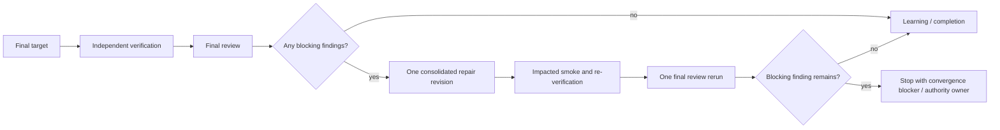
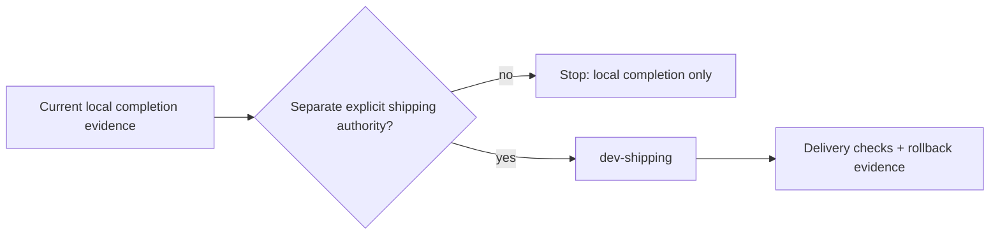

# Dev workflow convergence refinement

**Datetime**: 2026-08-09-1616
**Scope**: Generic `dev-*` engineering workflow contracts, routing, executor plans, implementation orchestration, bounded assurance, canonical decision capture, documentation, and OMP/Grok behavioral validation
**Summary**: Make approved outcome progress—not stage, agent, artifact, audit, review, or retry count—the primary convergence signal. Preserve one thin router and independent assurance while adding executor-grade plans, a capable-parent orchestration contract, deterministic route/todo projection, one bounded post-assurance repair round, and durable adopted/rejected workflow decisions.
**Status**: DONE

## Execution gate

```json
{"version":1,"authority":{"kind":"omp-local","uri":"local://dev-workflow-convergence-refinement-plan.md"},"bindings":[],"blockers":[]}
```

## Route Overview

Goal: Refine the generic engineering workflow so approved implementation reaches observable acceptance quickly, preserves root-cause discipline and independent proof, and leaves a durable repository-owned record of both adopted and rejected workflow choices.
Route: `dev-implementation → dev-verification → dev-code-review → dev-continual-learning → dev-ask completion presentation`; within `dev-implementation`, execute T1 first, T2 and T3 as one bounded parallel wave, then T4 and T5 in dependency order before T6 assurance.
Why: Product and architecture authority for this refinement are decision-complete in the current prompt and the documented grilling selections below. The work is cross-cutting and multi-wave, but its interfaces can be fixed before execution; no new requirements, specification, Wayfinder, architecture survey, or further grilling stage is needed unless this exact authority changes.
Artifacts: four focused workflow ADRs plus `docs/adr/INDEX.md`; revised workflow skills/rules/persona and concise `WORKFLOW.md`; one portable Executor Plan contract and validator; targeted router/backend/live fixtures; OMP/Grok activation and transport evidence; terminal Handoff and completion evidence.
Gates: approval of this exact plan revision; launch-time full-orchestration profile attestation or a disclosed contract-preserving one-owner downgrade; explicit reapproval only for material authority, route, scope, acceptance, topology escalation, destructive/external effects, or shipping changes; independent verification and final review of the immutable final target.
Execution: full orchestration by the capable current parent, with no nested planner tree and only the T2/T3 bounded worker wave; assurance: standard.
First action: T1—create the repository-owned ADR index/records, staging allow-list entry, and minimal discovery pointer before changing executable workflow contracts.

## Objective

- Outcome: OUT-DEV-WORKFLOW-CONVERGENCE
- Observable end state: The approved generic engineering workflow converges on named acceptance with portable execution plans, bounded orchestration, independent boundary proof, and durable current authority.
- Progress signal: One or more of AC01–AC15 advances, a named blocker is resolved, or exact decision evidence changes authority or the next owner.

The completed workflow must make this causal order observable and enforceable:

```text
current approved outcome and acceptance
→ minimum required authority/design work
→ implementation progress against named criteria
→ worker smoke
→ boundary-scoped independent verification
→ one final review
→ at most one consolidated post-assurance repair round
→ impacted re-verification and review
→ terminal narrow learning assessment
→ completion presentation
```

A semantic pass counts as progress only when it does at least one of the following:

1. implements or proves a named approved acceptance criterion;
2. resolves a named blocker that prevented such implementation or proof;
3. produces new decision evidence that changes approved authority, scope, acceptance, topology, or next owner; or
4. returns an explicit terminal blocker/escalation after consuming the authorized diagnostic or repair budget.

Planning prose, diagnosis without a changed falsifiable hypothesis, another audit of unchanged evidence, artifact count, agent count, review count, token use, elapsed time, or an unchanged Handoff is not progress and cannot authorize another cycle.

## Authority

| Authority ID | Kind | URI | Revision | Approval |
|---|---|---|---|---|
| AUTH-PLAN | direct | `local://dev-workflow-convergence-refinement-plan.md` | approved-2026-08-09-1616 | Explicitly approved by the user in the current execution conversation. |

### Evidence precedence

This plan is implementation authority only after the user approves its exact revision. Until then it is a proposal. The selected grilling answers below are settled design input; plan approval confirms their exact projection into the ADRs and executable contracts.
On 2026-08-09, the user explicitly confirmed this decision evidence as shared understanding and directed that the plan remain `PENDING`. That confirmation is not implementation approval.


Precedence during implementation:

1. current explicit user instruction and approval;
2. this exact approved plan revision and any exact approved requirements/specification/direct authority it names;
3. current repository-owned executable workflow contracts (`SKILL.md`, rules, `WORKFLOW.md`) and active ADRs, which must be changed atomically when this plan requires it;
4. current Task Contracts, Context Packs, Handoffs, and immutable target evidence derived from that authority;
5. repository evidence and targeted fixtures;
6. external sources and Atlas research as advisory evidence only.

A conflict among current executable contracts and active ADRs is a blocker; do not choose a winner silently. Archived plans, superseded ADRs, Atlas research passes, memories, transcripts, and external articles are not execution authority.

## Governing decisions

| Decision ID | Revision | Execution effect |
|---|---|---|
| ADR-0001 | active-2026-08-09 | Keep one thin router, stable route approval, bounded grilling, human authority, clean cutover, and separate shipping. |
| ADR-0002 | active-2026-08-09 | Use one portable Executor Plan body, capable-parent attestation, exact task projection, and no nested orchestration skill. |
| ADR-0003 | active-2026-08-09 | Smoke each task, prove consumable boundaries, review once, and allow one consolidated post-assurance repair. |
| ADR-0004 | active-2026-08-09 | Use minimal canonical discovery and explicit or event-driven Deep continual learning. |

### Human-confirmed decision detail

The documented grilling round selected all nine decisions below. They become durable `ADOPTED` decisions when this exact plan is approved and T1 materializes them.

| ID | Decision | Adopted behavior | Explicitly rejected behavior |
|---|---|---|---|
| D01 | Durable decision authority | Use focused ADRs under `docs/adr/` with one stable `docs/adr/INDEX.md`. | One ever-growing decision register; embedding rationale/history in `WORKFLOW.md`; using plans, memory, or Atlas as normative authority. |
| D02 | Approval model | Approve one stable Route Overview; retain explicit approval of decision/requirements/specification artifacts; reapprove the route only on material route facts. | Reapprove every stage return; let one initial approval silently cover later product/architecture/destructive decisions. |
| D03 | Post-assurance repair | Collect all blockers in one proof/review pass, authorize one consolidated repair revision, rerun impacted proof and final review once, then stop/escalate. | Unlimited repair/review recursion; two automatic repair rounds; per-plan generous retry choices. |
| D04 | Assurance boundaries | Smoke every task; independently verify each consumable isolated lineage before fan-in and the final integrated or single-lineage target; review the final target once. | Independent verify/review after every task; final-only proof when unverified lineages are fan-in inputs. |
| D05 | Grilling bound | Ask the whole load-bearing frontier in one round, allow one follow-up only for newly exposed dependencies, then emit decision evidence or a named blocker. | An exhaustive unbounded interview; ordinary ambiguity/factual lookup routed to grilling. |
| D06 | Orchestrator binding | Use a provider-neutral parent Orchestrator Role Profile with launch-time attestation; full orchestration fails closed or uses an approved contract-preserving downgrade. Do not add a new lifecycle skill. | A dedicated nested orchestrator agent by default; best-effort unverified capability/model selection; a skill pretending it can upgrade its own model. |
| D07 | Deep continual learning | Trigger deep maintenance only from explicit human request or settled cross-contract/recurring-defect evidence. | Every-Nth-invocation counters; calendar audits; router-owned timers/state; background transcript mining. |
| D08 | Executor plan shape | Use a layered portable plan containing objective, authority, maps, graph, boundaries, and acceptance, with exact per-task Task Contracts/Context Packs. | One huge duplicated plan; a checklist that makes executors rediscover intent; a second runtime state machine. |
| D09 | Todo projection | Render only applicable `Authority / Design`, `Build`, `Assurance`, and `Completion` phases; bind tasks to stable criterion IDs and always expose required assurance. | Route owners mirrored one-for-one as ceremonial todos; dependency graph without assurance visibility; `Implementation → Completion` when proof is still required. |

Additional decisions already required by the prompt and existing authority:

- D10: keep `dev-ask` the sole thin, stateless router; no competing router, baton ledger, workflow state machine, or execution state in the router.
- D11: keep lifecycle depth, assurance profile, and execution topology independent.
- D12: preserve human authority for product behavior, architecture, material scope, destructive effects, and shipping.
- D13: preserve clean cutover; migrate every affected caller/fixture/document and remove obsolete paths rather than leaving aliases or compatibility shims.
- D14: keep shipping separately and explicitly authorized; local completion never implies staging, commit, push, release, deploy, or rollout.
- D15: use `WORKFLOW.md` for concise current behavior, ADRs for rationale and rejected alternatives, and Atlas only for research evidence.

## Scope, non-goals, and prohibited effects
- Read surfaces: Generic `dev-*` skills, their adapters, portable plan rules, planner projections, bounded harness bindings, repository workflow ADRs, and targeted fixtures.
- Change surfaces: Only the targets named in TGT-ADR through TGT-FINAL under the task ownership and effects below.
- Non-goals: Product behavior, a second router or runtime ledger, provider fallback, a new lifecycle skill, broad research storage, and shipping.
- Prohibited effects: No staging, commit, push, release, deploy, credential change, user-level AGENTS mutation, live-symlink edit, or unapproved external effect.

| Effect ID | Kind | Authority | Limit / reversibility |
|---|---|---|---|
| EFF-REPO | repository-write | AUTH-PLAN | Named dotfiles source targets only; reversible locally; excludes staging, shipping, live symlink targets, and user-level guidance. |


### In scope

- Every existing `dev-*` lifecycle skill and the `grill-me`, `grill-with-docs`, and `wayfinder` adapters where they participate in engineering routing.
- Route classification, stage ownership, approval/reapproval, Handoff return, route-to-todo projection, and completion presentation.
- Executor-grade plan semantics shared by OMP and Grok, while retaining separate transport adapters.
- Parent orchestration, Context Packs, task progress, diagnosis, verification, integration, review, repair, continual learning, and completion accounting.
- Repository-owned discovery and durable adopted/rejected workflow decisions.
- Targeted deterministic fixtures and fresh-session behavior checks.

### Out of scope

- Product strategy or project-specific application behavior.
- A new router, orchestration lifecycle skill, evaluator role, retry state machine, review stage, memory backend, issue tracker, or workflow service.
- Automatic model purchasing/account switching, token escalation, credential changes, or provider fallback.
- Recreating Cursor's swarm, custom VCS, recursive planner tree, Field Guide, or SQLite experiment.
- Copying Anthropic's six-step migration pipeline into ordinary engineering work.
- Treating Bennett's formal weakness metric as an agent-memory/rule score.
- Automatic deep-maintenance scheduling, transcript mining, or mutation of `/Users/kim/.agents/AGENTS.md`.
- Shipping or staging the eventual implementation without separate authorization.

### Prohibited implementation effects

- Do not weaken current authority, safety, compatibility/degraded-behavior, immutable identity, smoke, independent verification, neutral fan-in, review, residual-risk, or shipping boundaries.
- Do not let verifier, integrator, reviewer, curator, planner, or router repair implementation in place.
- Do not turn ADRs, todos, plans, Handoffs, or Context Packs into competing runtime ledgers.
- Do not place provider/model/tool names in the portable semantic plan contract; adapters own concrete bindings.
- Do not load every ADR or the full workflow history for ordinary direct work.

## Current versus proposed behavior matrix

| Area | Current observed behavior | Proposed behavior | Reason | Affected authority |
|---|---|---|---|---|
| Convergence signal | Local Task Contract objectives and terminal criteria exist, but no run-wide goal delta gates another semantic pass. | Stable outcome/criterion IDs and a progress tuple gate every attempt, wave, repair, and return. | Prevent procedurally valid work from replacing outcome progress. | `dev-implementation`, `dev-handoff`, `dev-ticketing` |
| Retry scope | Three semantic attempts/no fourth is bounded only per unchanged Task Contract revision; a new repair revision can reset the loop. | Preserve the local attempt bound and add one inherited same-outcome post-assurance repair allowance across revisions. | Close the revision-reset treadmill without deleting recovery. | `dev-implementation`, verification/review fixtures |
| Diagnosis | Correctly excludes routine failures, but aggressive loop language has no explicit same-defect re-entry stop. | Hard unexplained bug/performance only; one bounded diagnosis returns a fix contract, blocker, or architecture finding; known/routine defects repair directly. | Keep root-cause quality while avoiding default detours. | `dev-diagnosing-bugs`, `dev-ask` |
| Verification granularity | Every changed observable/consequential target can be read as requiring independent proof, multiplying per-ticket assurance. | Smoke every task; independent proof at consumable lineage/final boundaries and explicit high-consequence checkpoints. | Preserve safe fan-in and final proof with less ceremony. | `dev-implementation`, `dev-verification` |
| Final review | Read-only review is correct, but every failed new revision can restart repair/reproof/review. | One final review pass, one consolidated repair if blocking findings exist, one impacted review rerun. Advisories remain residual risk. | Bound the assurance tail. | `dev-code-review`, `dev-implementation` |
| Approvals | The router distinguishes material drift, but stage returns and ticketing wording can imply repeated router approval. | Stable approved route continues automatically; artifact approvals remain; only material route facts cause route reapproval. | Remove duplicate waiting without weakening authority. | `dev-ask`, requirements/specification/ticketing |
| Route/todo display | Assurance is an immutable backend property, but observed projections can end in either `Assurance` or generic `Completion`. | Todo phases always expose required Assurance tasks separately from Completion; skipped stages disappear deterministically. | Completion must not imply unobserved checks. | `WORKFLOW.md`, `dev-ask`, `dev-implementation` |
| Grilling | Candidate/refinement routing is correct; the reusable interview is exhaustive and can be open-ended. | One complete frontier plus at most one newly-dependent follow-up; ordinary missing requirements/facts/direct edits remain near misses. | Preserve decision quality and bound interaction. | `dev-grilling`, wrappers, route fixtures |
| Executor plans | Base plan lifecycle/transport is strong; implementation-plan semantics omit targets, graph/waves, shared contracts, criterion mapping, effects, and Handoff. | One portable layered Executor Plan v1 plus per-task contracts and structural validator. | Less-capable executors should not rediscover product intent or sequencing. | `plan.md`, `plan-impl-spec.md`, planner persona/backend |
| Orchestration | Topology rules are strong, but no portable attested parent-orchestrator profile exists. | Full orchestration requires launch-time provider-neutral profile evidence; one owner remains default; no nested planner tree. | Capability truth belongs at launch, not inside a skill. | `dev-implementation`, harness adapters |
| Context | Context Packs exclude transcripts/stale reasoning but do not carry run-wide outcome progress or inherited repair budget. | Carry only exact authority, target/criterion IDs, dependency Handoffs, progress delta, repair budget, and receiver. | Reduce drift and context growth. | `dev-implementation`, `dev-handoff` |
| Durable decisions | `WORKFLOW.md` records current behavior; no stable adopted/rejected decision index exists. | Four focused ADRs plus stable index, linked through one minimal repository discovery pointer. | Future refinements need rationale and explicit rejected choices. | `docs/adr`, `.agents/AGENTS.md`, `WORKFLOW.md` |
| Continual learning | Standard/high work receives one terminal assessment; compact is trigger-driven; deep maintenance is undefined. | Standard remains narrow and terminal; deep is explicit/event-driven, separate from routine completion unless a current contract conflict blocks correctness. | Keep ordinary completion cheap and learning evidence-based. | `dev-continual-learning`, ADR-0004 |
| Skill architecture | Responsibilities are mostly distinct but wrapper/support/return relationships are unevenly documented. | Preserve skills; normalize owner/adapter roles, return envelopes, and skip/invalid conditions. | Deepen existing seams instead of adding stages. | skill catalog and Handoff contracts |

## Target workflow invariants

1. **Outcome before ceremony.** Current executable authority plus unmet acceptance routes to implementation, not renewed planning, diagnosis, audit, or review.
2. **One owner per responsibility.** Router classifies; requirements own observable policy; specification owns technical design; ticketing owns the derivative graph; backend owns execution; leaf assurance roles remain read-only/neutral.
3. **Stable authority.** One approved route and one stable outcome/criterion set remain current until a named material trigger changes them.
4. **Derivative artifacts.** Plans, tickets, todos, Task Contracts, Context Packs, and Handoffs project authority; none grants new authority.
5. **Bounded semantics.** No fourth semantic attempt per unchanged Task Contract, no automatic second post-assurance repair revision, no unchanged-hypothesis retry, and no process-only continuation.
6. **Proof at useful boundaries.** Worker smoke is local and cheap; independent verification guards consumable lineages and the final target; review occurs once at the final target.
7. **Context by reference.** Transfer exact revisions, decisions, criteria, target identity, changed evidence, and receiver—not transcripts or repeated prose.
8. **Assurance is visible but orthogonal.** `compact | standard | high-consequence` remains metadata that determines proof arrangement; the todo view still exposes the required assurance work.
9. **Deep maintenance is not a completion tax.** A deep candidate becomes a separately authorized maintenance route unless current stale/conflicting guidance blocks correctness.
10. **Shipping stays outside.** Completion evidence cannot authorize external delivery.

## Deterministic routing model

Classification remains intent-, authority-, evidence-, consequence-, and lifecycle-based. Keyword matches are evidence only. Use this order:

1. safety/external-effect authority;
2. route fog beyond one reliable context;
3. product authority;
4. observable requirements and expected behavior;
5. candidate approach/refinement intent;
6. factual evidence gaps or disposable fidelity needs;
7. artifact depth;
8. assurance profile;
9. execution topology and capability availability.

| Observable request state | Required initial owner/route | Skip or invalid routes | Return/continuation |
|---|---|---|---|
| Current evidence fully answers a read-only question | Direct answer; `dev-ask` only if Route Overview was explicitly requested | Grilling, requirements, implementation | Answer plus evidence; no approval |
| One bounded factual engineering question needs new evidence | `dev-research` | Grilling and product decision-making | Research Evidence to requesting owner; route continues/recomputes only if facts changed it |
| Product behavior/priority/strategy authority is missing | `PRODUCT AUTHORITY REQUIRED` | Requirements/specification/research deciding product policy | Human/product owner |
| Product authority exists, but observable behavior/scope/constraints/acceptance are incomplete and no candidate approach is being refined | `dev-requirements` | Grilling by default; implementation | Approved requirements artifact, then stable route continuation |
| Candidate approach/hypothesis/plan/design direction is unsettled and the user asks to refine/challenge/compare/validate it | `grill-with-docs` when repository evidence bears on the decision; otherwise `grill-me` | Ordinary factual lookup, missing-requirements intake, settled edits | Immutable decision evidence plus Handoff; `dev-ask` recomputes, but reapproval occurs only if material route facts changed |
| A hard unexplained reproducible bug or performance regression has settled expected behavior | `dev-diagnosing-bugs` | Feature work, known cause, routine implementation/proof failure | One fix contract/blocker/architecture finding to implementation/authority owner |
| Cause and bounded fix are already established, including routine worker/verifier/reviewer defects | `dev-implementation` repair | Diagnosis, renewed specification without an authority gap | Same stable outcome; inherited repair budget |
| A design question needs runnable logic/state/UI fidelity | `dev-prototype` | Production implementation or prototype-as-final | Decision evidence to requirements/grilling/specification owner |
| The user explicitly requests a broad architecture survey and no exact approved change exists | `dev-improve-codebase-architecture` | Ordinary refactor/review/direct implementation | Selected candidate and constraints to `dev-ask`; grilling bound applies |
| Complete one-context direct implementation authority exists | `dev-implementation`, one owner by default | Requirements/specification/ticketing/Wayfinder | Smoke → boundary proof → final review → learning → completion |
| Durable multi-context technical decisions remain | `dev-specification`; then `dev-ticketing` only when graph/recovery/fan-in warrants it | Direct implementation until approved | Approved artifacts continue through the already-approved prospective route |
| Destination/decision route cannot fit one reliable context | `wayfinder` | Large-but-specified work; implementation inside Wayfinder | Resolved decision map to `dev-ask`; no build work |
| Exact implementation graph is current but large | `dev-implementation`, bounded batch/full orchestration according to actual topology | Wayfinder and eager recursive replanning | Ready-frontier execution |
| Local completion evidence is current | `dev-ask` completion presentation | New approval, shipping inference, replayed lifecycle | Terminal report only; shipping remains separate |
| Explicit shipping action is separately authorized | `dev-shipping` | Inference from local completion | Delivery evidence and rollback state |

Deterministic classification ends at these observable predicates. Bounded agent judgment remains for interpreting evidence quality, materiality, one-context fit, genuine independence, and consequence; every such judgment must cite its evidence in the Route Overview or Task Contract.

### Required grilling fixture

Input:

> Repository-local rules can be automatically injected into agent and subagent sessions, but ADRs, `ARCHITECTURE.md`, and similar contracts are not. I propose using repository-local `.agents/AGENTS.md` for discovery, with only the ADR index rather than every ADR. Give me a refined approach.

Expected initial route:

```text
dev-ask
→ grill-with-docs
→ immutable decision evidence + Handoff
→ dev-ask recomputation
→ requirements/specification/implementation as current authority requires
```

The interview must ask one complete decision frontier and at most one newly-dependent follow-up. The user's decision-evidence confirmation is an internal grilling completion condition, not an extra Route Overview approval. If recomputation preserves the exact approved prospective route and authority, continue; otherwise present the changed route for approval.

## Skill disposition table

No lifecycle skill is merged, split, or removed. The simplification is a deeper common contract and explicit adapter/owner boundaries, not more stages.

| Skill | Disposition | Unique responsibility after refinement | Required change |
|---|---|---|---|
| `dev-ask` | Revise | Sole thin/stateless classification, approval, first dispatch, material reapproval, completion presentation | Outcome-first continuation; stable-route approval; full route display; canonical discovery pointer only under maintenance trigger |
| `dev-requirements` | Revise lightly | Observable behavior, boundaries, acceptance, scope, constraints | Explicit field boundary from specification; common route-impact Handoff; no re-entry when complete |
| `dev-research` | Keep/lightly align | Bounded factual evidence | Common route-impact return; never a planning substitute |
| `dev-grilling` | Revise | Reusable decision interview | One frontier + one dependent follow-up; decision/blocker return; confirmation is not a route gate |
| `grill-me` | Revise lightly | Stateless adapter to `dev-grilling` | State adapter relationship and return contract |
| `grill-with-docs` | Revise lightly | Repository-evidence adapter to `dev-grilling` | State adapter relationship; canonical-write gate stays in domain owner |
| `dev-prototype` | Keep/lightly align | Disposable runnable/visual decision evidence | Add route-impact Handoff; no production continuation authority |
| `dev-specification` | Revise lightly | Technical architecture/interfaces/data/migration/test seams | Requirements-to-spec field mapping; stable continuation; no duplicate route approval |
| `dev-ticketing` | Revise | Minimum acyclic vertical implementation graph | Criterion IDs/waves/output receivers; direct backend continuation on unchanged route; no todo authority |
| `dev-implementation` | Revise substantially | Capable-parent backend, topology, task projection, attempts, smoke, assurance orchestration, convergence, completion | Outcome/progress tuple; Orchestrator Role Profile; boundary proof; inherited one-repair budget; canonical todo projection |
| `dev-diagnosing-bugs` | Revise | Hard unexplained bug/performance diagnosis | Bounded same-defect invocation; direct known-cause repair near miss; exact stop/receiver |
| `dev-verification` | Revise lightly | Fresh read-only criterion proof at declared boundaries | Boundary identity, exact blocker aggregation, no planning/diagnosis redirect without authority gap |
| `dev-integration` | Keep/lightly align | Neutral verified-lineage fan-in | Carry outcome/criterion IDs and inherited budget; skip single-lineage work |
| `dev-code-review` | Revise lightly | One final read-only Standards/Specification verdict | Consolidated blocker set; advisories cannot reopen; one repair receiver |
| `dev-continual-learning` | Revise | One neutral standard terminal assessment; explicit/event-driven deep maintenance | Standard/deep modes, least-specific sufficient rule heuristic, held-out/near-miss validation, deep route non-blocking by default |
| `dev-handoff` | Revise | One shared revision-bound transfer | Outcome ID, criteria delta, route impact, inherited repair budget, next criterion/receiver |
| `dev-shipping` | Keep | Separately authorized delivery and rollback evidence | No lifecycle change |
| `dev-domain-modeling` | Keep/lightly align | Canonical terminology and exact durable-write gate | ADR writes only from approved exact plan/decision content; no passive loading requirement |
| `dev-codebase-design` | Keep | Deep-module design vocabulary/discipline | Remain a support lens, not a route stage |
| `dev-improve-codebase-architecture` | Revise lightly | Explicit survey/candidate selection | Use bounded grilling and exact return envelope |
| `dev-tdd` | Keep | Explicit or requested implementation method | Remain inside implementation, never a mandatory lifecycle stage |
| `wayfinder` | Revise lightly | Multi-session decision map for genuine route fog | Outcome-progress and bounded return; never implementation tickets/build state |

## Lifecycle route diagrams

### Direct cohesive work



### Planned cross-cutting work



Stage returns do not add a second route approval when the approved prospective route and all material route facts remain exact.

### Hard-bug diagnosis



Known-cause and routine implementation/proof failures skip diagnosis and go directly to bounded repair.

### Migration

```mermaid
flowchart LR
  A[Feasibility + approved compatibility/parity authority] --> B[Specification]
  B --> C[Dependency graph / tickets]
  C --> D[Implementation waves]
  D --> E[Smoke each unit]
  E --> F[Verify consumable lineages]
  F --> G[Neutral fan-in if needed]
  G --> H[Verify integrated/final target]
  H --> I[Final review]
  I --> J[Learning and completion]
```



A migration requires a judge before fan-out when existing tests cannot prove parity. It does not inherit Anthropic's fixed six-step topology when a cheaper project-specific loop exists.

### Assurance repair



### Shipping



## Canonical route-to-todo projection

The todo view is a derivative presentation, never an authority ledger. Project only applicable work:

```text
Authority / Design
  requirements, grilling decision, specification, or ticket graph only when required
Build
  vertical implementation Task Contracts tied to acceptance IDs
Assurance
  boundary verification
  integration only for multiple isolated verified lineages
  post-integration verification when integrated
  one final review
  required/triggered standard continual-learning assessment or compact trigger screen
Completion
  terminal evidence accounting
  dev-ask completion presentation
```

Rules:

- Equivalent route facts produce the same phase/task shape across harnesses and repeated runs.
- A skipped lifecycle stage produces no todo. `dev-ask`, Handoff transfers, approvals already represented by artifact gates, and runtime state transitions do not become ceremonial todos.
- Every Build todo maps to one approved Task Contract and at least one stable acceptance ID. No child may invent an unowned criterion or duplicate an existing one.
- Assurance is always visible when required even though the assurance profile remains immutable cross-cutting metadata.
- Completion contains no implied proof. It becomes ready only after every required Assurance todo is terminal.
- One consolidated repair appends one Build repair item and only the impacted Assurance items. It does not reopen completed Authority/Design tasks or reset the entire list.
- Wayfinder decision tickets and implementation tickets use distinct labels and never share a todo namespace.

## Executor Plan v1 contract

### Portable layered body

Revise `plan-impl-spec.md` so every durable implementation plan contains these semantic sections, while `plan.md` continues to own lifecycle/gate/identity and harness companions own transport:

1. `Objective`—one observable end state and progress signal.
2. `Authority`—exact approved route, requirements/specification/ticket/decision revisions and approvals.
3. `Governing decisions`—active ADR IDs/revisions and explicit rejected alternatives relevant to execution.
4. `Scope, non-goals, and prohibited effects`—read/change/must-not-change surfaces and external-effect limits.
5. `Fixed shared contracts`—interface/state/data ownership, compatibility, degraded behavior, approved breaks/removals.
6. `Target map`—stable target ID to path, symbol/behavior surface, owner, base identity, callers/fixtures, criteria.
7. `Execution policy`—assurance, topology, decomposition, contention, isolation, coordinator/fan-in, capability gates.
8. `Tasks`—monotonic task IDs with owner, wave, dependencies, targets, criteria, verification, effects, output/receiver.
9. `Acceptance`—stable criterion ID, condition/input, expected observable/threshold, surface, owning task.
10. `Verification / Done criteria`—proof class, scenario/environment/fixture, evidence form, target recheck, receiver.
11. `Result / Handoff`—required artifacts/identities, allowed outcomes, exact receiver, canonical Handoff reference.
12. `Blockers and recovery`—owner, exact recovery evidence, affected cone, revision/approval boundary, ready condition.
13. `Critical anchors and assumptions`—exact paths/symbols/rules/skills/ADRs and only pre-decided fallbacks.

A top-level plan links canonical requirements/specification/ADR content rather than copying it. A graph plan gives sequencing and contracts; each dispatched task receives its own immutable Task Contract and minimal Context Pack. Runtime `pending|ready|running|...` state remains backend-owned and is not serialized into the plan.

### Structural validator

Add one provider-neutral validator under `dev-implementation/scripts/` and use it from planner/backend preflight in both harnesses. It validates structure, not product judgment:

- required unique sections and stable IDs;
- task dependency DAG and wave consistency;
- every task target/contract/criterion reference resolves;
- every acceptance criterion has exactly one implementation owner and one verification recipe;
- no orphan target, unowned shared contract, duplicate criterion, unresolved placeholder, or undeclared output/receiver;
- topology/fan-in fields are present when multiple isolated lineages exist;
- `Tasks` and `Verification / Done criteria` retain the base plan checkbox/lifecycle shape.

Do not create a JSON sidecar, second plan authority, or provider-specific semantic parser. OMP keeps `local://` authority and byte-exact repository projection. Grok uses a thin repository/session transport companion that binds the same portable semantic body and validator result; its model/role/tool metadata remains outside the plan.

### Task Contract additions

Extend the existing Task Contract rather than adding another contract:

```markdown
## Outcome progress
- Parent outcome: OUT-ID @ [authority revision]
- Owned acceptance: AC-ID...
- Expected progress signal: [observable delta]
- Current frontier: [unmet criterion or named blocker]
- Inherited convergence: semantic attempts [used]/[max]; post-assurance repair [unused or consumed]
- Required return: implemented | proved | blocker-resolved | authority-change | no-progress-stop
```

Every Handoff returns:

```text
parent outcome and authority revision
criteria advanced / unchanged
expected versus observed delta
named blocker resolved or remaining
changed falsifiable hypothesis, if any
exact target identity and evidence
route-impact: unchanged | changed
inherited attempt/repair budget
next unmet criterion and one eligible receiver
```

A Handoff with no criterion delta, blocker resolution, changed authority, or authorized diagnostic evidence cannot authorize another semantic attempt.

## Capable-parent orchestration and context model

### Orchestrator Role Profile

Add a provider-neutral role profile owned by `dev-implementation`, containing:

- exact Task Contract/plan digest and authority revision;
- concrete runtime identity, harness adapter, model selector/source, reasoning level, and no-fallback state;
- effective capabilities for reading/writing, dependency scheduling, bounded delegation, observation/control, Handoff validation, target identity, and recovery;
- maximum supported child depth and concurrency;
- isolation/fan-in mechanics and external-effect constraints;
- live-attested versus documentation-inferred fields.

Full orchestration begins only when the current parent satisfies the profile at launch. The skill cannot upgrade itself. If attestation is unavailable or mismatched, either execute the exact same graph sequentially/with one owner when that is a contract-preserving approved downgrade, or stop `transport-unavailable`; never silently dispatch a dedicated orchestrator or weaker model.

### Parent responsibilities

The capable parent retains only the global load-bearing context:

- exact authority, ADRs, outcome/criterion map, topology, capability profile, shared contracts, dependency graph, integration policy, repair budget, and completion accounting;
- ready-frontier scheduling, one Task Contract/Context Pack per owner, Handoff validation, failed-cone quarantine, and one repair authorization;
- no leaf implementation when a viable executor owns that work;
- no nested planner/subagent trees; workers do not delegate;
- direct parent edits only for plan lifecycle/terminal accounting or a separately declared tiny mechanical coordinator artifact, never application/skill behavior.

### Context Pack rules

Each fresh owner receives only:

- exact Task Contract and relevant ADR/requirements/specification revisions;
- fixed shared contracts and exact dependency Handoffs;
- bounded target/repository/environment context and project-rule manifest;
- safety/effect constraints, expected progress signal, inherited convergence budget, and Handoff receiver.

Exclude orchestration transcripts, sibling reasoning, unchanged prior prose, speculative audits, stale summaries, and unrelated ADRs. Automatic compaction is fallback recovery only; it is not the primary context strategy.

For this plan's eventual implementation, use one root parent, no nested tree, and a single T2/T3 bounded wave with disjoint primary ownership. T4 consumes both returns; T5 performs cohesive synchronization. No neutral integration stage is needed if both workers mutate one coordinated lineage. If the adapter instead isolates them into distinct lineages, independently verify each lineage and use `dev-integration` before T4.

## Bounded diagnosis, assurance, and repair

### Diagnosis

1. Require settled expected behavior and a stable reproduction/performance baseline.
2. Reject feature work, generic audits, routine worker/proof failures, and known causes.
3. Build one red-capable loop, minimize it, rank 3–5 falsifiable hypotheses, instrument predictions, and establish the root cause or exact blocker.
4. Return exactly one fix contract, blocker, or architecture finding. Do not mutate production code or write the final regression test/fix.
5. Do not invoke diagnosis again for the same defect identity unless genuinely new evidence invalidates the prior hypothesis. A valid fix contract routes directly to implementation.
6. If evidence expands product behavior, architecture, ownership, acceptance, or material scope, stop for the owning authority and reapproval; do not silently broaden the fix.

### Assurance boundaries

- Worker smoke for every task/attempt on the exact produced revision.
- Independent verification for the final single-lineage target; each isolated lineage before neutral fan-in; the integrated target after fan-in; and any explicitly approved high-consequence checkpoint.
- No independent verification merely because a plan has many sequential tasks in one lineage.
- One final read-only Standards/Specification review after the final target is verified.
- Standard assurance uses distinct verifier and reviewer identities. High-consequence keeps decorrelated identities. Compact keeps its existing ordered non-implementer arrangement.

### One consolidated repair round

```text
initial implementation attempts (existing per-revision maximum: 3, no fourth)
→ one verifier pass
→ one final review pass
→ aggregate every blocking finding
→ one owner-authorized consolidated repair revision
→ impacted smoke and verification
→ one final review rerun
→ complete or stop
```

The repair revision inherits the same outcome ID, acceptance set, finding IDs, and a consumed post-assurance repair token. It may use the existing per-revision semantic attempt ladder, but a new derivative revision cannot restore the consumed post-assurance allowance. A remaining blocker, repeated frontier, unchanged hypothesis, or inconclusive proof after the rerun stops with exact evidence and returns to the named authority/human owner. A material change to product scope, architecture, ownership, acceptance, approved approach, destructive effects, or external-effect authority closes the old run and requires a new approved route; it is not another repair.

Collect findings once. Advisories and speculative audits do not authorize repair. Reuse a verifier/reviewer session only when immutable target separation, role separation, and fresh evidence remain provable; otherwise use fresh identities.

## Canonical discovery and continual learning

### Repository discovery

T1 creates:

```text
docs/adr/INDEX.md
docs/adr/0001-dev-workflow-authority-and-routing.md
docs/adr/0002-executor-plans-and-orchestration.md
docs/adr/0003-bounded-assurance-and-repair.md
docs/adr/0004-canonical-discovery-and-continual-learning.md
```

`manifest` gains `docs`. `.agents/AGENTS.md` gains one compact conditional pointer: agents changing or diagnosing the generic engineering workflow read `.config/agents/skills/dev-ask/WORKFLOW.md` and `docs/adr/INDEX.md`; ordinary work loads only its applicable skill/rule and the active ADRs named by its Task Contract.

Each ADR contains status, date, scope, context/problem, adopted decision, rejected alternatives with reasons, consequences/invariants, affected contracts, evidence/source revisions, human authority, supersession/reopen conditions, and verification expectations. `INDEX.md` contains only ID, title, status, scope, path, affected authority, and supersession links. It is a registry, not a queue or runtime ledger.

`WORKFLOW.md` stays current and concise:

1. Human overview—purpose, guarantees, common routes, approval model, decision-index pointer.
2. Engine reference—routing table, ownership, invariants, escalation, route composition, todo projection.
3. Skill catalog—one short description and link per skill/adapter.
4. Maintenance guidance—how to evaluate, change, test, and simplify the framework.
5. Sources—principal inspirations and evidence limits.

Source precedence is explicit and synchronized: active skills/rules/`WORKFLOW.md` and active ADRs must agree in one change. If they do not, stop. Superseded/rejected ADRs remain discoverable history but never execute. Atlas stores research, not normative decisions.

### Continual-learning modes

**Standard**

- Runs once after a settled standard/high-consequence outcome; compact keeps its qualifying-trigger screen.
- Inspects only artifacts affected by the completed work.
- Updates only directly impacted existing project-owned rules, skills, tests, indexes, ADR status, and current `WORKFLOW.md` contract.
- Validates any proposed durable rule against the source case plus at least one independent adjacent/near-miss case.
- Returns exactly: `Updated`, `Added`, `Removed`, `Skipped`, `Validation`, and `Deep candidate`, with `NO DURABLE LEARNING` valid.

**Deep**

- Activates only on explicit human request or settled evidence of a recurring/cross-contract defect, stale/conflicting canonical set, or severe systemic incident.
- Is a separately authorized maintenance route unless current contradictory guidance blocks correctness of the just-completed outcome.
- Audits the broader canonical set for duplication, conflict, stale paths, false triggers, missing removals, and cross-harness drift.
- Does not use an invocation counter, calendar, router state, or background transcript mining.

Use Bennett's paper only as a bounded curation heuristic: prefer the least-specific rule that is sufficient and verified under approved authority, not the shortest prose or broadest instruction. Keep detailed evidence outside the always-loaded rule. Do not implement the paper's formal weakness metric or claim it proves continual learning, reflection, memory, or LLM self-improvement.

## External evidence synthesis

| Source | Evidence used | Adopt/adapt | Reject or limit |
|---|---|---|---|
| Cursor, “Agent swarms and the new model economics” | Planner/worker context specialization, explicit design ownership, shared decision docs, neutral conflict resolution, held-out outcome grading, strong-planner/efficient-worker economics | Capable parent retains global intent; workers receive narrow contracts; measure acceptance, not activity; expose contention/fan-in | No hundreds-agent default, recursive tree, custom VCS, agent-owned always-injected Field Guide, unlimited stacked reviews, or model-specific policy |
| Cursor curated plugins/`orchestrate` | Explicit orchestration, planner/worker/verifier roles, structured Handoffs, script-owned state at extreme scale | Preserve explicit topology and structured returns; use deterministic backend state only when full orchestration truly requires it | Do not adopt its “no finished state until planner stops publishing,” recursive subplanners, or isolated cloud tree for ordinary work |
| Matt Pocock curated skills | Small composable skills, user-invoked wrappers versus reusable disciplines, domain language, tracer tickets, feedback loops | Keep wrapper/discipline distinction and narrow skill responsibilities | Reject “grill every change” and frequent architecture surveys as blanket policy; route by actual intent/evidence |
| Anthropic code-migration kit | Judge before work, deterministic dependency map, rulebook for repeat ambiguities, cheap smoke before expensive parity, recurring failure → process/rule candidate | Apply to migrations and general feedback-cost placement | Do not impose the six steps or implementer + two reviewers + fixer per unit on generic work; no provider settings as portable policy |
| Flexcompute agent control loop | Measurable constraints, tolerance/blast radius, context as versioned code, verification as termination | Acceptance is the convergence condition; place reliable feedback near effects | Continuous per-microtask independent proof is not always economical; use worker smoke and boundary proof based on cost/risk |
| PostHog skill guidance | Job-to-be-done skills, progressive disclosure, single source of truth, test skills, not every task deserves a skill | Keep skill bodies lean and load references on demand; validate activation/near misses | Reject skill proliferation, duplicated volatile facts, and automatic transcript-derived institutional memory |
| Bennett, arXiv:2301.12987v4 | In a finite symbolic formalism with uniform task prior, maximizing extension/“weakness” among valid hypotheses beat MDL on small addition/multiplication tasks | Translate only to least-specific sufficient verified durable guidance plus held-out near misses | No general continual-learning claim, no LLM/memory experiment, no broad-rule preference, no formal score in this workflow |
| Atlas workflow/harness research | Singular owner interfaces, explicit state, stable indexes, research/currentness boundaries | Reuse as advisory design evidence and source links | Dirty research topics and instance notes are not repository workflow authority |

### Faithful paper synopsis

Bennett defines a finite implementable language and a statement's extension `Z_l`; “weakness” is `|Z_l|`, the number of admissible statements/decisions left open. Under the paper's finite formalism and uniform distribution over parent tasks, a valid child-task hypothesis with larger extension generalizes to more possible parent tasks. A counterexample shows minimum description length is neither necessary nor sufficient for maximizing that extension. The experiments compare weakness-selected versus MDL-selected propositional hypotheses on small 8-bit addition and multiplication child/parent tasks; weakness wins the displayed exact-generalization and extent cells. The study has no online feedback, persistent memory, self-reflection, forgetting, nonstationarity, LLM agent, workflow repair loop, or continual-learning benchmark. Its representation, task prior, symbolic search, and oracle scoring sharply limit transfer. This plan therefore adopts only the guarded engineering heuristic above.

## Fixed shared contracts
| Contract ID | Surface | Owner task | Revision | Consumers |
|---|---|---|---|---|
| CONTRACT-ADR | Focused workflow ADR authority and minimal discovery | T1 | ADR-0001..0004 active-2026-08-09 | T2, T3, T4, T5, T6 |
| CONTRACT-ROUTE | Outcome-first routing, stable approval, bounded grilling, and todo phases | T2 | route-contract-2026-08-09 | T4, T5, T6 |
| CONTRACT-EXECUTOR | Executor Plan v1, Task Contract, Context Pack, Handoff progress, and parent profile | T3 | executor-contract-v1 | T4, T5, T6 |
| CONTRACT-CONVERGENCE | Bounded diagnosis, assurance boundaries, one repair, and learning modes | T4 | convergence-contract-2026-08-09 | T5, T6 |
| CONTRACT-SYNC | Current workflow, fixtures, generated projections, and harness bindings | T5 | synchronization-contract-2026-08-09 | T6 |
| CONTRACT-ASSURANCE | Independent final verification, review, learning, and terminal accounting | T6 | assurance-contract-2026-08-09 | none |


- `dev-ask` stays the sole external router and never owns execution state.
- Existing approved requirements/specification/direct authority remains semantic authority; plans/tickets/tasks only project it.
- Plan lifecycle (`PENDING → IN_PROGRESS → DONE/CLOSED`) remains separate from backend task/run state.
- Handoff remains the sole result-transfer schema; this plan adds fields, not a second envelope.
- Assurance profile remains immutable and independent from lifecycle depth/topology.
- Review, verification, integration, and curation remain non-repair roles.
- OMP retains local authority and byte-exact repository projection. Grok gains only a thin contract-equivalent semantic-plan transport; storage behavior need not be identical.
- The dotfiles repository remains source of truth; live symlink targets are never edited.
- `/Users/kim/.agents/AGENTS.md` is not a curation target.

## Target map

| Target ID | Path / surface | Owner task | Base identity | Callers / fixtures | Criteria |
|---|---|---|---|---|---|
| TGT-ADR | `docs/adr/INDEX.md`, ADR-0001..0004, `manifest`, `.agents/AGENTS.md` | T1 | approved-plan baseline | Repository discovery smoke | AC01, AC02 |
| TGT-ROUTE | Router, grilling adapters, support-stage returns, and route fixtures | T2 | approved-plan baseline | Router and near-miss fixtures | AC03, AC04, AC05 |
| TGT-WORKFLOW | `.config/agents/skills/dev-ask/WORKFLOW.md` | T5 | approved-plan baseline | Fresh workflow discovery and route projection | AC01, AC05, AC13 |
| TGT-PLAN | Portable plan rules, validator, tests, and Grok transport companion | T3 | approved-plan baseline | Planner and backend preflight fixtures | AC06 |
| TGT-ORCH | `dev-implementation` Task Contract, Context Pack, projection, attempts, and parent profile | T3 | approved-plan baseline | Backend state and profile fixtures | AC05, AC07, AC08, AC10, AC11 |
| TGT-HANDOFF | `dev-handoff` Common Handoff and recovery payload | T3 | approved-plan baseline | Task, verifier, reviewer, and recovery fixtures | AC08, AC11 |
| TGT-ASSURE | Diagnosis, verification, integration, code-review, and continual-learning contracts | T4 | approved-plan baseline | Convergence and learning fixtures | AC09, AC10, AC11, AC12 |
| TGT-PLANNER | Canonical planner persona, projector, OMP and Grok projections, and planner transport | T3 | approved-plan baseline | Projector and transport tests | AC06, AC07, AC14 |
| TGT-EVAL | `dev-ask/evals/evals.json` and paired fixture directories | T5 | approved-plan baseline | Router, backend, live, and near-miss evaluations | AC01, AC03, AC04, AC05, AC06, AC07, AC08, AC09, AC10, AC11, AC12, AC13, AC14 |
| TGT-HARNESS | OMP and Grok semantic-plan and parent-attestation adapter surfaces | T5 | approved-plan baseline | OMP extension tests and fresh harness sessions | AC06, AC07, AC14 |
| TGT-FINAL | Complete synchronized repository target and terminal evidence | T6 | T5 exact Handoff revision | Independent verifier and reviewer | AC15 |

Before editing exported scripts/persona generators, use LSP references when available and preserve generated-source ownership. Do not edit generated OMP/Grok persona projections directly; update `.config/agents/personas/planner/PERSONA.md` and its projector.

### Shared acceptance contribution map

| Criterion | Observable end state | Owning task(s) |
|---|---|---|
| AC01 | Fresh agents discover `WORKFLOW.md` and the ADR index through one minimal repository pointer; rejected/superseded records remain findable but non-executable. | T1, T5 |
| AC02 | Every material decision in this plan, including every explicit rejection, exists in one focused active ADR/index entry with approval and supersession semantics. | T1 |
| AC03 | Candidate approach, factual lookup, incomplete requirements, hard bug, known fix, settled direct edit, and large specified work route deterministically to distinct expected owners. | T2, T5 |
| AC04 | One stable route approval continues through unchanged artifact/stage returns; only named material changes require reapproval. | T2, T5 |
| AC05 | Equivalent route facts produce identical Authority/Design, Build, Assurance, Completion todo shapes; required assurance never disappears into Completion. | T2, T3, T5 |
| AC06 | OMP and Grok planners produce/consume Executor Plan v1 semantics with complete target/dependency/criterion/effect/Handoff fields; structural omissions fail before mutation. | T3, T5 |
| AC07 | Full orchestration starts only under a live-attested portable parent profile; mismatch safely downgrades under the same contract or fails closed. | T3, T5 |
| AC08 | Every Task Contract/Handoff carries stable outcome/criterion IDs, expected/observed progress, route impact, exact target, inherited attempt/repair budget, and next receiver. | T3, T4 |
| AC09 | Routine/known-cause failures skip diagnosis; hard diagnosis stops at one fix contract/blocker/architecture finding and cannot repeat unchanged. | T4, T5 |
| AC10 | Smoke occurs per task, independent verification at declared lineage/final boundaries, neutral integration only for multiple isolated verified lineages, and one final review. | T4, T5 |
| AC11 | Verification/review blockers are consolidated into one repair revision; impacted proof/review reruns once; a remaining blocker stops rather than restarting the lifecycle. | T4, T5 |
| AC12 | Standard learning remains one narrow terminal assessment; deep maintenance is explicit/event-driven with no counter/calendar/background mutation. | T4, T5 |
| AC13 | `WORKFLOW.md` has the five concise sections and reflects current executable behavior without duplicating ADR rationale or evidence history. | T5 |
| AC14 | Skill frontmatter/activation, rule conditions/scopes, planner projections, OMP transport, and Grok transport remain valid under targeted checks. | T5, T6 |
| AC15 | Independent verification and final review approve one immutable final target; terminal evidence proves every task/criterion and no unauthorized staging/shipping/user-level mutation. | T6 |

## Execution policy

- Assurance: standard
- Topology: full-orchestration
- Max concurrency: 2
- Isolation: shared repository lineage
- Lineages: shared
- Fan-in task: none
- Fan-in inputs: none
- Contention policy: T2 and T3 use disjoint primary ownership in one bounded wave; all other tasks run in dependency order.
- Decomposition: one capable parent, child depth one, no worker delegation, and no nested planner tree
- Effect limit: EFF-REPO only
- Orchestrator profile: `.config/agents/skills/dev-implementation/references/orchestrator-role-profile.md` with live attestation and no fallback


- Topology: full orchestration by the current capable parent; no nested planner tree.
- Assurance: standard; distinct implementation, verification, and review identities.
- Shared lineage default: one coordinated repository target. T2 and T3 have disjoint primary write ownership; neither may edit the other's primary targets without a parent-authorized contract revision.
- Isolation fallback: if the harness isolates T2/T3, each becomes a distinct lineage requiring independent verification and neutral integration before T4.
- Parent does not implement skill/rule behavior; it binds contracts, dispatches, observes, validates Handoffs, handles dependency cones, and accounts completion.
- A contract-preserving sequential/one-owner projection is the only allowed capability downgrade. Topology escalation or weakened independence requires reapproval.

| Wave | Tasks | Depends on | Parallelism / contention | Required output |
|---|---|---|---|---|
| W0 | T1 | Approved plan | One owner; new `docs/adr` plus discovery/manifest only | Active ADR/index revision and discovery Handoff |
| W1 | T2, T3 | T1 | Bounded parallel wave; T2 owns route/current-workflow surfaces, T3 owns plan/backend/planner surfaces | Two complete Handoffs with AC mappings; no overlapping primary edits |
| W2 | T4 | T2 and T3, or their verified integrated target if isolated | One cohesive owner because convergence crosses backend and assurance roles | Bounded diagnosis/proof/repair/learning contracts and fixtures |
| W3 | T5 | T4 | One cohesive synchronization owner | Current docs, all fixtures, generated projections/adapters synchronized |
| W4 | T6 | T5 | Fresh verifier then separate reviewer; no mutation | Verification Handoff, review Handoff, terminal evidence or one consolidated repair contract |

A failed task quarantines its dependent cone. Demonstrably unaffected work may continue, but no descendant consumes partial/diagnostic/failed output. One post-assurance repair, if needed, is derivative T6 work and does not create a new lifecycle phase or reopen T1–T5.

## Tasks

- [x] T1. Establish focused workflow ADR authority and discovery
  completed 2026-08-09-1855
  - Owner: workflow-adr-worker
  - Wave: W0
  - Depends on: none
  - Targets: TGT-ADR
  - Contracts: CONTRACT-ADR
  - Criteria: AC02
  - Effects: EFF-REPO
  - Output: OUTP-T1
  - Receiver: implementation-parent
  - Verification: VR-AC02
  - Lineage: shared
- [x] T2. Refine routing approvals grilling and todo projection
  completed 2026-08-09-1934
  - Owner: routing-worker
  - Wave: W1
  - Depends on: T1
  - Targets: TGT-ROUTE
  - Contracts: CONTRACT-ADR, CONTRACT-ROUTE
  - Criteria: AC03, AC04
  - Effects: EFF-REPO
  - Output: OUTP-T2
  - Receiver: implementation-parent
  - Verification: VR-AC03, VR-AC04
  - Lineage: shared
- [x] T3. Add executor plans capable orchestration and context contracts
  completed 2026-08-09-1936
  - Owner: orchestration-worker
  - Wave: W1
  - Depends on: T1
  - Targets: TGT-PLAN, TGT-ORCH, TGT-HANDOFF, TGT-PLANNER
  - Contracts: CONTRACT-ADR, CONTRACT-EXECUTOR
  - Criteria: AC05, AC06, AC07, AC08
  - Effects: EFF-REPO
  - Output: OUTP-T3
  - Receiver: implementation-parent
  - Verification: VR-AC05, VR-AC06, VR-AC07, VR-AC08
  - Lineage: shared
- [x] T4. Bound diagnosis assurance repair and continual learning
  completed 2026-08-09-2003
  - Owner: convergence-worker
  - Wave: W2
  - Depends on: T2, T3
  - Targets: TGT-ORCH, TGT-HANDOFF, TGT-ASSURE
  - Contracts: CONTRACT-ADR, CONTRACT-ROUTE, CONTRACT-EXECUTOR, CONTRACT-CONVERGENCE
  - Criteria: AC09, AC10, AC11, AC12
  - Effects: EFF-REPO
  - Output: OUTP-T4
  - Receiver: implementation-parent
  - Verification: VR-AC09, VR-AC10, VR-AC11, VR-AC12
  - Lineage: shared
- [x] T5. Synchronize workflow docs fixtures and harness adapters
  completed 2026-08-09-2133
  - Owner: synchronization-worker
  - Wave: W3
  - Depends on: T4
  - Targets: TGT-WORKFLOW, TGT-EVAL, TGT-HARNESS, TGT-PLANNER
  - Contracts: CONTRACT-ADR, CONTRACT-ROUTE, CONTRACT-EXECUTOR, CONTRACT-CONVERGENCE, CONTRACT-SYNC
  - Criteria: AC01, AC13, AC14
  - Effects: EFF-REPO
  - Output: OUTP-T5
  - Receiver: dev-verification
  - Verification: VR-AC01, VR-AC13, VR-AC14
  - Lineage: shared
- [x] T6. Independently verify review and account final outcome
  completed 2026-08-09-2329
  - Owner: assurance-backend
  - Wave: W4
  - Depends on: T5
  - Targets: TGT-FINAL
  - Contracts: CONTRACT-ADR, CONTRACT-ROUTE, CONTRACT-EXECUTOR, CONTRACT-CONVERGENCE, CONTRACT-SYNC, CONTRACT-ASSURANCE
  - Criteria: AC15
  - Effects: EFF-REPO
  - Output: OUTP-T6
  - Receiver: dev-ask
  - Verification: VR-AC15
  - Lineage: shared

## Detailed task contracts

### T1. Establish focused workflow ADR authority and discovery

**Objective:** Materialize D01–D15 as repository-owned, human-approved, discoverable decision authority without creating runtime state.

**Targets:** TGT-ADR; add `docs` to `manifest`; add only the conditional workflow pointer to `.agents/AGENTS.md`; add the decision-index pointer to `WORKFLOW.md` only if T1 can do so without conflicting with T2 ownership, otherwise return the exact insertion contract to T2.

**Procedure:**

1. Create `docs/adr/INDEX.md` and ADR-0001..0004 with the exact decision grouping in `Canonical discovery`.
2. Record adopted behavior, every rejected alternative in this plan, evidence links/revisions, consequences, affected contracts, human approval, and reopen/supersession triggers.
3. State that current skills/rules/`WORKFLOW.md` and active ADRs must be updated atomically; conflicts fail closed.
4. Keep the index small; no task states, owner queue, route history, attempt counters, timestamps for ordinary invocations, or Atlas content copies.
5. Update the staging allow-list and minimal repository pointer.

**Acceptance:** AC01, AC02. A fresh read-only subagent given only repository guidance finds the index, identifies all four active ADRs, distinguishes a rejected/superseded entry from executable authority, and does not load every record for unrelated work.

**Prohibited:** no changes to executable skill behavior; no user-level AGENTS edit; no decision register inside `WORKFLOW.md`; no implementation status ledger.

**Output/receiver:** Common Handoff with exact ADR/index identities, manifest/pointer evidence, decisions accounted, and T2/T3 as eligible receivers.

### T2. Refine routing approvals grilling and todo projection

**Objective:** Make route classification, stable approval continuation, bounded grilling, stage ownership, and visible todo projection deterministic from current route facts.

**Targets:** TGT-ROUTE and TGT-WORKFLOW; router fixtures and exact near misses under TGT-EVAL. Do not modify TGT-ORCH/TGT-PLAN primary files.

**Procedure:**

1. Add the outcome-first continuation predicate to `dev-ask`: complete authority + unmet acceptance → implementation; no process-only detour.
2. Clarify prospective `Route` versus immediate `First action`; show verification/review/learning/completion in the complete route while dispatching only one first owner.
3. Apply D02: artifact approvals stay explicit; unchanged approved route transitions continue without another route approval; enumerate material triggers exactly.
4. Apply D05 to `dev-grilling` and wrappers; normalize wrapper/adaptor ownership; make user confirmation an interview completion condition, not a second router gate.
5. Align requirements/specification/ticketing and support-stage Handoffs around `route-impact: unchanged|changed`; remove ticketing's ambiguous intermediate-router owner wording.
6. Define D09 in `WORKFLOW.md`: only applicable phases/tasks, criterion binding, explicit Assurance, no Handoff/router ceremony todos.
7. Preserve current near misses for direct answers, factual research, requirements, known bug, large specified work, prototype, and architecture survey.

**Acceptance:** AC03, AC04, route half of AC05. The required ADR-index proposal routes first to `grill-with-docs`; its three stated near misses do not. Equivalent requests produce the same full route and todo phase names.

**Prohibited:** no router runtime state, todo state, execution dispatch logic, plan semantic parser, new approval gate, new skill, or product decision.

**Output/receiver:** Common Handoff with route table revision, fixture IDs/results, changed versus unchanged route semantics, and T4/T5 receivers.

### T3. Add executor plans capable orchestration and context contracts

**Objective:** Give fresh/less-capable OMP and Grok executors one validated portable plan and exact per-task contracts while making capable-parent orchestration fail closed.

**Targets:** TGT-PLAN, TGT-ORCH, TGT-HANDOFF, TGT-PLANNER; targeted tests under TGT-EVAL/TGT-HARNESS. Do not change route classification or `WORKFLOW.md` current-behavior prose.

**Procedure:**

1. Extend `plan-impl-spec.md` with the ordered Executor Plan v1 contract; keep `plan.md` lifecycle/identity and OMP/repository companion ownership intact.
2. Add the single structural validator and positive/negative fixtures. Validate DAG/waves, ID/reference closure, criteria ownership/proof mapping, effects, outputs, and no placeholders; do not judge product semantics or add a sidecar.
3. Define Grok's thin contract-equivalent plan transport only where current repository/storage rules are insufficient; do not promise OMP-identical storage/archive mechanics.
4. Extend the Task Contract and Context Pack with `Outcome progress` and inherited convergence fields.
5. Extend the Common Handoff with criterion delta, route impact, budget, next frontier, and one receiver.
6. Add the Orchestrator Role Profile and launch-time attestation. Reuse/generalize existing planner transport/profile seams only when that reduces duplication without weakening planner no-code/no-delegation guarantees; migrate every caller if renamed.
7. Update the canonical planner persona/projector so planning output follows Executor Plan v1 and the existing Handoff; never edit generated projections directly.
8. Define canonical route-to-task/todo projection in the backend, consuming T2's phase contract without making todos authoritative.

**Acceptance:** AC05 backend half, AC06, AC07, AC08. A complete same-semantic fixture validates in both harness contexts; each load-bearing missing/duplicate/dangling/cyclic fixture fails before mutation; a mismatched parent profile cannot start full orchestration.

**Prohibited:** no model/provider in portable plan; no second plan/runtime state machine; no duplicated OMP/Grok semantic parser; no silent fallback; no dedicated nested orchestrator.

**Output/receiver:** Common Handoff with plan/validator/profile identities, positive and negative proof, generated projection proof, transport capability limits, and T4/T5 receivers.

### T4. Bound diagnosis assurance repair and continual learning

**Objective:** Preserve root-cause and independent proof while making the same approved outcome converge through at most one consolidated post-assurance repair.

**Targets:** TGT-ORCH, TGT-HANDOFF, TGT-ASSURE; convergence fixtures under TGT-EVAL. Consume T2 route facts and T3 outcome/budget fields.

**Procedure:**

1. Add direct-known-cause/routine-failure near misses and same-defect diagnosis stop/return.
2. Change backend proof scheduling to D04 boundary semantics while preserving worker smoke and high-consequence explicit checkpoints.
3. Make verifier/reviewer returns aggregate exact blocking criterion/finding IDs; advisories cannot create repair.
4. Implement D03's inherited one-repair allowance across derivative Task Contract revisions; preserve the existing three-attempt/no-fourth per-revision ladder and two safe transport retries.
5. Stop on a remaining blocker after impacted reproof/review, repeated frontier, unchanged hypothesis, or exhausted budget; return exact evidence to the authority/human owner without restarting planning.
6. Keep integration neutral and only for multiple isolated verified lineages.
7. Define Standard and Deep continual-learning modes per D07. Make a deep candidate a separate route by default. Add least-specific sufficient verified guidance plus held-out/near-miss validation; explicitly reject formal weakness scoring/background learning.
8. Make `CURATED`, `NO DURABLE LEARNING`, and compact `curation not triggered` terminal; `BLOCKED` names exact current-contract conflict or missing authority rather than starting an audit loop.

**Acceptance:** AC09, AC10, AC11, AC12. State traces show no diagnosis for routine failure, no per-task independent proof in one lineage, no second post-assurance repair, and no deep audit from count/time alone.

**Prohibited:** no repair by assurance roles; no fourth semantic attempt; no verifier/reviewer session reuse without fresh immutable evidence; no automatic lifecycle reset; no background/user-level curation.

**Output/receiver:** Common Handoff with convergence fixture evidence, preserved assurance invariants, residual risks, and T5 receiver.

### T5. Synchronize workflow docs fixtures and harness adapters

**Objective:** Make every canonical description, skill/rule trigger, generated projection, fixture, and supported harness express the same refined workflow.

**Targets:** TGT-WORKFLOW, TGT-EVAL, TGT-HARNESS, TGT-PLANNER and any lightly revised skill in the disposition table not already synchronized.

**Procedure:**

1. Rewrite `WORKFLOW.md` into the five approved concise sections, including human-readable routes and exact current engine semantics; link ADR index and sources without copying histories.
2. Ensure every disposition-table skill has one non-overlapping activation, exclusions, input/authority, output, stop, and receiver; remove obsolete duplicated wording/paths.
3. Extend `evals.json` and paired fixtures with the exact matrix below; retain existing IDs/near misses and required/forbidden event style.
4. Project canonical persona changes and prove generated OMP/Grok files byte-match their source generator.
5. Update OMP/Grok adapter/config/rule surfaces only for required semantic-plan binding and parent attestation; preserve adapter-specific transport differences.
6. Validate skill/rule frontmatter and activation in fresh sessions; ordinary routing must not load full `WORKFLOW.md`/ADR history.
7. Update ADR affected-contract/revision references and index status in the same change; do not add research prose to always-loaded rules.

**Required fixture matrix:**

- existing `R-APPROACH-REFINEMENT` and its read-only/requirements/direct near misses;
- complete-authority/unmet-acceptance direct implementation continuation;
- unchanged stage Handoff continuation without route reapproval;
- material authority/scope/acceptance/topology/destructive/shipping change requiring reapproval;
- equivalent route-to-todo projection with explicit Assurance;
- routine failure skipping diagnosis; hard unexplained defect entering diagnosis once;
- one post-assurance consolidated repair, remaining-blocker stop, no second repair;
- boundary verification versus per-task and unsafe-final-only near misses;
- Executor Plan complete/missing-field/dangling-reference/cycle fixtures;
- OMP/Grok semantic equivalence with transport difference disclosure;
- parent profile pass/mismatch/safe sequential downgrade;
- Standard narrow learning, Deep explicit/event trigger, count/calendar near misses;
- fresh subagent canonical index discovery and rejected/superseded non-execution;
- completion only after explicit assurance evidence; shipping remains absent.

**Acceptance:** AC01 final, AC03–AC14. Current docs and executable fixtures have no contradictory route, owner, approval, repair, or assurance statement.

**Prohibited:** no broad project suite; no provider-specific semantics in portable contracts; no hand-edited generated projections; no new skill unless this plan is reapproved.

**Output/receiver:** Integration-quality Handoff naming every exact target revision, fixture result, adapter limit, and T6 verifier.

### T6. Independently verify review and account final outcome

**Objective:** Prove the exact final repository target implements AC01–AC15, then obtain one read-only final review and terminal learning/accounting without repair inside assurance.

**Targets:** Immutable complete target from T5; all applicable project rules and active ADRs; verification/review/curation Handoffs.

**Procedure:**

1. Freeze target identity, rule manifest, plan/ADR/skill/rule/persona/fixture revisions, assurance profile, and verifier/reviewer separation.
2. Run targeted deterministic tests and fresh-session route/activation/plan-consumption smokes listed below.
3. Verify every AC criterion with expected/observed evidence and recheck target/fixtures after proof.
4. Send the exact verified target to one final `dev-code-review` Standards/Specification review.
5. If blocking findings exist, aggregate them once and authorize the single derivative repair allowed by D03; rerun only impacted checks plus preserved-behavior coverage, then one review rerun. If a blocker remains, stop without claiming completion.
6. Run one Standard continual-learning assessment; update only directly impacted current guidance/ADRs and validate changes. A Deep candidate becomes a separate proposed route.
7. Account every task/criterion, update the approved plan to `DONE` with evidence-backed Completion Summary, synchronize/archive through the active plan transport, and return terminal evidence to `dev-ask`. Do not stage or ship.

**Acceptance:** AC15 and every Verification / Done criterion. No claim may exceed the exact observed checks.

**Prohibited:** verifier/reviewer/curator repair; broad speculative audit; second repair; implicit stage/commit/push/release/deploy; archive before exact DONE contract.

**Output/receiver:** Verification Handoff, Review Handoff, curation outcome, terminal evidence index, and `dev-ask` completion presentation—or one exact blocker/resume Handoff.

## Acceptance

| Criterion ID | Condition / input | Expected observable / threshold | Surface | Owning task |
|---|---|---|---|---|
| AC01 | Fresh repository-guided agent | Finds the concise workflow and four-record ADR index without eager history loading; rejected or superseded records do not execute. | TGT-ADR, TGT-WORKFLOW, TGT-EVAL | T5 |
| AC02 | Approved D01–D15 authority | Every adopted decision and explicit rejection exists in one focused ACTIVE ADR with approval and supersession semantics. | TGT-ADR | T1 |
| AC03 | Candidate, factual, requirements, bug, direct, prototype, survey, and specified-work cases | Each routes to its distinct expected owner and near misses do not cross lanes. | TGT-ROUTE, TGT-EVAL | T2 |
| AC04 | Unchanged stage return or named material route change | Unchanged route continues without approval; every material trigger requires a revised Route Overview approval. | TGT-ROUTE, TGT-EVAL | T2 |
| AC05 | Equivalent route facts and backend projection | Exact applicable Authority / Design, Build, Assurance, Completion shape with Assurance explicit and Completion unable to imply proof. | TGT-ROUTE, TGT-ORCH, TGT-WORKFLOW, TGT-EVAL | T3 |
| AC06 | Complete or structurally invalid Executor Plan | One portable body validates for OMP and Grok planner/backend consumers; load-bearing omissions fail before mutation. | TGT-PLAN, TGT-PLANNER, TGT-HARNESS, TGT-EVAL | T3 |
| AC07 | Full orchestration launch under matching or mismatched parent attestation | Exact live match starts; approved one-owner downgrade is explicit; all other mismatch fails closed. | TGT-ORCH, TGT-PLANNER, TGT-HARNESS, TGT-EVAL | T3 |
| AC08 | Task Contract, Context Pack, and Handoff attempt | Stable outcome and criteria, expected and observed progress, route impact, target, budget, frontier, and one receiver are present; no-progress cannot continue. | TGT-ORCH, TGT-HANDOFF, TGT-EVAL | T3 |
| AC09 | Routine failure or hard unexplained defect | Routine or known cause repairs directly; hard diagnosis runs once and returns one fix contract, blocker, or architecture finding. | TGT-ASSURE, TGT-EVAL | T4 |
| AC10 | Shared or isolated task graph under standard assurance | Worker smoke occurs per task; independent proof occurs at declared lineage and final boundaries; neutral fan-in uses exact verified inputs; final review runs once. | TGT-ORCH, TGT-ASSURE, TGT-EVAL | T4 |
| AC11 | Blocking verifier or reviewer findings | One consolidated repair revision and one impacted proof/review rerun occur; remaining blocker stops with no fourth attempt or second repair. | TGT-ORCH, TGT-HANDOFF, TGT-ASSURE, TGT-EVAL | T4 |
| AC12 | Standard terminal learning or Deep candidate | Standard is narrow and terminal; Deep is explicit or evidence-triggered; counters, calendars, background mining, and user-level mutation are rejected. | TGT-ASSURE, TGT-EVAL | T4 |
| AC13 | Final `WORKFLOW.md` | Exactly five concise sections describe current behavior, skill catalog, maintenance, and bounded sources without history duplication. | TGT-WORKFLOW | T5 |
| AC14 | Fresh supported-harness activation and generated projection checks | Skill and rule frontmatter, planner projections, OMP transport, Grok binding, and ordinary context loading remain valid. | TGT-PLANNER, TGT-EVAL, TGT-HARNESS | T5 |
| AC15 | Immutable complete target after T5 | Distinct verifier returns VERIFIED for AC01–AC15, separate reviewer returns APPROVED, terminal learning/accounting passes, and no staging or shipping effect exists. | TGT-FINAL | T6 |

## Verification / Done criteria

- [x] VR-AC01. Verify minimal workflow and ADR discovery
  - Criterion: AC01
  - Proof class: live-behavior
  - Scenario / environment / fixture: Fresh repository-guided subagent discovery plus rejected and superseded non-execution fixture
  - Evidence form: Exact discovered paths, four ACTIVE index entries, and absence of eager unrelated ADR loading
  - Target recheck: TGT-ADR, TGT-WORKFLOW, TGT-EVAL
  - Receiver: dev-verification
- [x] VR-AC02. Verify focused durable decisions
  - Criterion: AC02
  - Proof class: static-inspection
  - Scenario / environment / fixture: ADR index and ADR-0001 through ADR-0004 decision and rejection accounting
  - Evidence form: Complete D01–D15 partition, explicit rejection coverage, approval, and supersession clauses
  - Target recheck: TGT-ADR
  - Receiver: dev-verification
- [x] VR-AC03. Verify deterministic route classification
  - Criterion: AC03
  - Proof class: live-behavior
  - Scenario / environment / fixture: Candidate-design fixture plus read-only, requirements, direct, known-fix, hard-bug, prototype, survey, and large-specified near misses
  - Evidence form: Expected first owner, full route, forbidden-event absence, and exact fixture IDs
  - Target recheck: TGT-ROUTE, TGT-EVAL
  - Receiver: dev-verification
- [x] VR-AC04. Verify stable approval continuation
  - Criterion: AC04
  - Proof class: live-behavior
  - Scenario / environment / fixture: Unchanged Handoff continuation and every named material reapproval trigger
  - Evidence form: No duplicate approval for unchanged facts and revised overview approval for each material change
  - Target recheck: TGT-ROUTE, TGT-EVAL
  - Receiver: dev-verification
- [x] VR-AC05. Verify canonical todo projection
  - Criterion: AC05
  - Proof class: targeted-test
  - Scenario / environment / fixture: Semantically equivalent route facts projected through router and backend fixtures
  - Evidence form: Identical ordered phase and task shape with explicit Assurance and proof-gated Completion
  - Target recheck: TGT-ROUTE, TGT-ORCH, TGT-WORKFLOW, TGT-EVAL
  - Receiver: dev-verification
- [x] VR-AC06. Verify Executor Plan v1
  - Criterion: AC06
  - Proof class: targeted-test
  - Scenario / environment / fixture: This plan and complete fixture in OMP and Grok planner/backend contexts plus every load-bearing negative mutation
  - Evidence form: `test_executor_plan.py` pass, valid identical semantic digest, stable negative issue codes, and no mutation
  - Target recheck: TGT-PLAN, TGT-PLANNER, TGT-HARNESS
  - Receiver: dev-verification
- [x] VR-AC07. Verify parent orchestration attestation
  - Criterion: AC07
  - Proof class: targeted-test
  - Scenario / environment / fixture: Exact full profile, mismatch, no-fallback, and approved sequential downgrade cases
  - Evidence form: `test_planner_transport.py` and profile test pass with exact start, downgrade, or transport-unavailable result
  - Target recheck: TGT-ORCH, TGT-PLANNER, TGT-HARNESS
  - Receiver: dev-verification
- [x] VR-AC08. Verify outcome progress transfer
  - Criterion: AC08
  - Proof class: targeted-test
  - Scenario / environment / fixture: Task Contract and Handoff progress, route-impact, inherited budget, next-frontier, and no-progress cases
  - Evidence form: Required fields resolve and unchanged output cannot authorize a new wave
  - Target recheck: TGT-ORCH, TGT-HANDOFF, TGT-EVAL
  - Receiver: dev-verification
- [x] VR-AC09. Verify diagnosis boundary
  - Criterion: AC09
  - Proof class: targeted-test
  - Scenario / environment / fixture: Routine known-cause failure and hard unexplained defect state traces
  - Evidence form: Direct repair for routine case and one bounded diagnosis return with no unchanged reinvocation
  - Target recheck: TGT-ASSURE, TGT-EVAL
  - Receiver: dev-verification
- [x] VR-AC10. Verify assurance boundaries
  - Criterion: AC10
  - Proof class: targeted-test
  - Scenario / environment / fixture: Shared-lineage task graph, isolated verified lineages, fan-in, final proof, and one final review
  - Evidence form: Worker smoke per task, no per-task independent proof in one lineage, verified-only fan-in, and final review count one
  - Target recheck: TGT-ORCH, TGT-ASSURE, TGT-EVAL
  - Receiver: dev-verification
- [x] VR-AC11. Verify consolidated repair bound
  - Criterion: AC11
  - Proof class: targeted-test
  - Scenario / environment / fixture: Initial blockers, one repair, impacted reproof/review, and remaining-blocker stop
  - Evidence form: One inherited repair token consumed, no second repair, no fourth semantic attempt, and exact terminal evidence
  - Target recheck: TGT-ORCH, TGT-HANDOFF, TGT-ASSURE, TGT-EVAL
  - Receiver: dev-verification
- [x] VR-AC12. Verify continual-learning modes
  - Criterion: AC12
  - Proof class: targeted-test
  - Scenario / environment / fixture: Standard narrow assessment, explicit or event-driven Deep, and count, calendar, background, user-level near misses
  - Evidence form: Terminal Updated, Added, Removed, Skipped, Validation, Deep candidate fields and rejected automatic triggers
  - Target recheck: TGT-ASSURE, TGT-EVAL
  - Receiver: dev-verification
- [x] VR-AC13. Verify concise current workflow
  - Criterion: AC13
  - Proof class: static-inspection
  - Scenario / environment / fixture: Final WORKFLOW five-section structure and decision-index linkage
  - Evidence form: Human overview, Engine reference, Skill catalog, Maintenance guidance, and Sources with no run history
  - Target recheck: TGT-WORKFLOW
  - Receiver: dev-verification
- [x] VR-AC14. Verify harness activation and projections
  - Criterion: AC14
  - Proof class: live-behavior
  - Scenario / environment / fixture: Frontmatter checks, `test_project.py`, `test_planner_transport.py`, OMP extension test, and fresh OMP and Grok planning sessions
  - Evidence form: Passing targeted commands, byte-exact generated outputs, same semantic contract, and truthful transport differences
  - Target recheck: TGT-PLANNER, TGT-EVAL, TGT-HARNESS
  - Receiver: dev-verification
- [x] VR-AC15. Verify and review the immutable final target
  - Criterion: AC15
  - Proof class: independent verification
  - Scenario / environment / fixture: Fresh AC01–AC15 verification, separate final review, Standard learning, terminal accounting, and no-effect inspection
  - Evidence form: VERIFIED Handoff, APPROVED review, terminal curation result, exact target identity, and no staging or shipping evidence
  - Target recheck: TGT-FINAL
  - Receiver: dev-verification

## Result / Handoff

| Output ID | Producing task | Artifact / identity | Allowed outcomes | Receiver | Handoff contract |
|---|---|---|---|---|---|
| OUTP-T1 | T1 | Exact TGT-ADR revision and AC02 evidence | completed, blocked, authority-change-required | implementation-parent | Common Handoff from dev-handoff |
| OUTP-T2 | T2 | Exact TGT-ROUTE revision and AC03–AC04 evidence | completed, blocked, authority-change-required | implementation-parent | Common Handoff from dev-handoff |
| OUTP-T3 | T3 | Exact TGT-PLAN, TGT-ORCH, TGT-HANDOFF, and TGT-PLANNER revisions | completed, blocked, transport-unavailable, authority-change-required | implementation-parent | Common Handoff from dev-handoff |
| OUTP-T4 | T4 | Exact TGT-ASSURE convergence revision and AC09–AC12 evidence | completed, blocked, authority-change-required | implementation-parent | Common Handoff from dev-handoff |
| OUTP-T5 | T5 | Exact synchronized TGT-WORKFLOW, TGT-EVAL, TGT-HARNESS, and TGT-PLANNER revision | completed, blocked, transport-unavailable, authority-change-required | dev-verification | Common Handoff from dev-handoff |
| OUTP-T6 | T6 | Exact immutable TGT-FINAL verification, review, learning, and terminal evidence | completed, blocked, failed | dev-ask | Common Handoff from dev-handoff |

## Blockers and recovery

| Blocker ID | Owner | Recovery evidence | Affected tasks | Revision / approval boundary | Ready condition |
|---|---|---|---|---|---|
| BLK-MATERIAL | dev-ask | Revised exact authority and approved Route Overview for a material decision | all | New plan or authority revision when product, architecture, route, scope, acceptance, topology, effects, proof, or shipping changes | Current approved bytes and dependent contracts validate before mutation. |
| BLK-TRANSPORT | implementation-parent | Live capability attestation or exact approved contract-preserving one-owner downgrade | all | No semantic authority change for equivalent downgrade; reapproval for weakened independence or topology escalation | Required native or contract-equivalent capability is observed with no fallback. |

## Critical anchors and assumptions

| Anchor ID | Kind | Exact reference | Execution role |
|---|---|---|---|
| ANC-PLAN | authority | `local://dev-workflow-convergence-refinement-plan.md` | Sole current plan authority and lifecycle record. |
| ANC-ADR | decision index | `docs/adr/INDEX.md` | Resolves active durable workflow decisions and supersession links. |
| ANC-ROUTER | skill | `.config/agents/skills/dev-ask/SKILL.md` | Sole thin routing and completion presentation contract. |
| ANC-IMPLEMENTATION | skill | `.config/agents/skills/dev-implementation/SKILL.md` | Backend, task projection, attempts, smoke, assurance orchestration, and accounting. |
| ANC-PLAN-RULE | rule | `.config/agents/rules/plan-impl-spec.md` | Portable Executor Plan v1 semantic contract. |
| ANC-VALIDATOR | script | `.config/agents/skills/dev-implementation/scripts/executor_plan.py` | Shared planner and backend structural preflight. |
| ANC-PLANNER | persona | `.config/agents/personas/planner/PERSONA.md` | Canonical generated planner behavior. |

- ASM-CAPABILITY: The current parent remains live-capable for the approved shared-lineage graph; otherwise only the exact contract-preserving sequential downgrade is eligible.
- ASM-TRANSPORT: OMP and Grok share portable plan semantics while retaining truthful adapter-specific identity, storage, model, and tool mechanics.

### Contingencies

- The exact plan approval authorizes the four ADR contents described here; no separate domain-write interview is needed unless execution discovers a new term/decision not present in this plan.
- Existing route/assurance/state fixtures remain preserved unless an exact criterion above intentionally supersedes them. Update paired near misses in the same change.
- The current three semantic attempts per unchanged Task Contract remain available. D03 adds a run-wide post-assurance repair bound; it does not remove the local red/green/fresh-context ladder.
- Grok need not replicate OMP's `local://` projection/archive mechanics. It must bind the same semantic plan contract and exact revision through a truthful adapter.
- If the current parent cannot be live-attested for full orchestration, the default contingency is the same graph executed sequentially by one qualified owner. If that would weaken isolation, independent assurance, recovery, or authority, stop for a revised route rather than improvising.
- If T2/T3 cannot retain disjoint write ownership, execute them sequentially in the declared order; do not create a merge conflict or new topology.
- External sources are time-sensitive advisory evidence. Record their URL/title/access date in ADR sources, but do not make their mutable content runtime authority.
- If fresh-session smoke reveals a harness cannot activate a required rule/skill or consume Executor Plan v1, report `transport-unavailable` and finish every harness-neutral artifact/test before declaring the exact blocker.

## Material approval boundary

Approval of this plan confirms:

- the nine documented grilling choices D01–D09;
- derived invariants D10–D15;
- the four exact ADR destinations and groupings;
- the Executor Plan v1 and single structural validator design;
- capable-current-parent orchestration with fail-closed attestation and no new lifecycle skill;
- visible lifecycle-phase todos;
- boundary-scoped independent proof;
- one consolidated post-assurance repair allowance;
- event/explicit-only Deep maintenance;
- the T1–T6 dependency graph, full-orchestration topology, standard assurance, targets, prohibited effects, and verification matrix.

Reapproval is required if execution changes any of those decisions, creates/removes/merges/splits a lifecycle skill, changes product/architecture authority, broadens scope, weakens proof/independence, adds a repair round, changes ADR destination, introduces destructive/external effects, or requests shipping. Mechanical wording, formatting, generated projections, and contract-preserving sequential downgrade do not require reapproval.

## Sources

Primary/advisory sources inspected for this plan:

- Cursor, [Agent swarms and the new model economics](https://cursor.com/blog/agent-swarm-model-economics), accessed 2026-08-09.
- Cursor, [official plugins and curated skills](https://github.com/cursor/plugins), including `orchestrate`, accessed 2026-08-09.
- Matt Pocock, [Skills for Real Engineers](https://github.com/mattpocock/skills), accessed 2026-08-09.
- Anthropic, [How Anthropic runs large-scale code migrations with Claude Code](https://claude.com/blog/ai-code-migration) and [code-migration kit](https://github.com/anthropics/code-migration-kit-with-claude-code), accessed 2026-08-09.
- Flexcompute, [The Agent Control Loop—Engineering for Tolerance](https://engineering.flexcompute.com/articles/agent-control-loop/), 2026-01-19.
- PostHog, [Writing skills](https://posthog.com/handbook/engineering/ai/writing-skills), [What nobody tells you about writing agent skills](https://newsletter.posthog.com/p/what-nobody-tells-you-about-writing), and the requested [PostHog status](https://x.com/posthog/status/2084345938089316582), accessed 2026-08-09. X blocked direct automated reading; the official handbook/newsletter supplied the substantive guidance.
- Michael Timothy Bennett, [The Optimal Choice of Hypothesis Is the Weakest, Not the Shortest](https://arxiv.org/abs/2301.12987v4), arXiv:2301.12987v4, 2024-04-11.
- Atlas: `vault://atlas/ARCHITECTURE.md`, `vault://atlas/summaries/research/agent-systems/harness/topics/lean-self-improving-agent-harness/INDEX.md`, and bounded workflow/harness research topics. Atlas remains advisory and subject to its freshness contract.

## Completion Summary

Completed 2026-08-09-2329.

- Outcome: AC01–AC15 VERIFIED; the final Standards and Specification review rerun returned APPROVED with no findings or advisories.
- Assurance: one consolidated post-assurance repair cleared `REV-PLAN-GATE-001`, `REV-PLANNER-CAPS-002`, `REV-PLANNER-ROOT-003`, and `REV-PLANNER-CLEANUP-004`; the repair token and review rerun are consumed 1/1.
- Learning: the one terminal Standard assessment returned `NO DURABLE LEARNING`; no guidance or target bytes changed.
- Evidence: the repaired 218-entry target `TGT-FINAL-after-assurance-repair-2026-08-09-2241` remained byte-exact at tree SHA-256 `08f5fcc739e25b4d7fdfc74aa22db50ada87a6451dc37700c5e6429105bcafdc` through verification, review, learning, and AC15 accounting.
- Checks: planner transport 26/26, Executor Plan 5/5, orchestrator profile 8/8, planner projection 10/10, OMP plan transport 51/51 with 494 assertions, Ruff check, and Ruff format check passed.
- Effects: repository changes only; no staging, commit, push, release, deploy, or shipping authority/effect occurred.
- Residual risk: no authenticated provider smoke was rerun after the bounded repair; deterministic transport fixtures and the prior supported-harness evidence cover the changed seams.

### Later override — 2026-08-10

- Outcome: the approved follow-on refinement removed the fixed two-round grilling cap, made complete current-frontier interviews iterative, reduced redundant downstream approvals, added optional external-intake triage, and made approval/completion presentation compact and route-truthful.
- Assurance: the 35-file target at aggregate SHA-256 `44dfbc59382555b4001523c4f90a9dde3361f991a1ca0fc83e319dfe58b21239` passed all six follow-on acceptance criteria. Initial review findings `WF-REVIEW-STATE-001`, `WF-REVIEW-ROUTE-002`, `WF-REVIEW-TRIAGE-003`, and `WF-REVIEW-AUTHORITY-004` were closed by one consolidated repair; the follow-on outcome's repair token and review rerun are consumed 1/1.
- Verification: all 115 eval records and fixtures parsed, remained uniquely bound, and matched inputs/replies; targeted integrated-to-verified, compact no-learning, wontfix receiver, grilling, approval, drift, and triage smokes passed; all 35 target and 12 canonical dependency identities matched before and after independent verification and review.
- Review: the sole post-repair Standards and Specification rerun returned `APPROVED` with no blockers or advisories.
- Learning: the terminal Standard assessment returned `NO DURABLE LEARNING`; the four qualified corrections were already encoded with source and adjacent near-miss coverage, so no target or guidance bytes changed.
- Effects: repository changes only; no tracker mutation, staging, commit, push, release, deploy, or shipping authority/effect occurred.
- Residual risk: verification used bounded contract inspection, deterministic fixture checks, and targeted model smoke; no external tracker or delivery effect was exercised, consistent with the approved non-goals.
