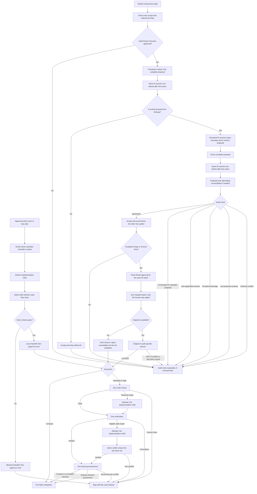

# Engineering execution flow

This is a human-only overview. It does not run work or define transitions. `dev-ask`, `dev-implementation`, and the executable stage skills are authoritative.

The semantic route names `dev-implementation`, while the invoking route agent normally performs that controller role in place. Standalone entry uses its invoking agent the same way. Only a topology already approved by the human may insert a separate controller; that controller owns its children and returns across the real boundary without recursive controller delegation or outer-agent double scheduling.

## Entry and implementation

For a new boundary, apply the shared
[task-sizing guidance](../../dev-ticketing/references/task-sizing.md) before
choosing direct or planned entry. Record only a brief rationale in existing
prose. The sizing heuristic neither adds a stage nor changes assurance, and an
approved graph is projected without automatic repartitioning.

Before drafting, specification, planless direct-contract, ticket-graph, and
standalone-plan authors resolve the applicable current authority and shared
sizing, proof, plan, and canonical sources for decisions they own. Storage and
the actual harness companion are resolved only when publishing. After a
substantive candidate, the same author applies the shared planning
rethink once before final submission or execution readiness and may make at
most one bounded correction. A delegated caller sends it as an explicit
follow-up to that same author; an inline author loads it as a separate step. A
new ownership/dependency graph is substantive even with exact projected
acceptance. Exact projections, storage copies, lifecycle-only updates, and
unchanged approved contracts bypass this authoring pass. This adds no route
owner, stage, state, or approval gate.

Before checks bind, specification, self-contained plan, and direct-contract
authors use the shared `dev-implementation/references/test-value.md` policy.
Projection preserves exact acceptance; later meaning changes return to
authority.

| From | Condition | Next |
|---|---|---|
| Approved direct work | One child can own and check the cohesive result in one reliable fresh context | Route-owning agent activates `dev-implementation` in place and dispatches the distinct child without a controller self-Handoff |
| Approved lean plan | Necessary multiple-owner or dependency ownership, fan-in, ordered effects or migration, or recovery uses known safe task seams | In-place controller schedules dependency-ready child tasks; any ordinary fan-in is an authored child-owned task completed before final review and verification |
| Prerequisite Handoff | Next-owner role is `dev-implementation` and route impact is unchanged | Concrete route owner activates its controller role in place unless the approved topology already bound a separate controller; no extra approval or router hop |
| Prerequisite Handoff | Next-owner role is `dev-ask` | Concrete route owner resumes router recomputation before continuing |
| Candidate | Child has finished its first implementation pass | Same child receives the single implementation code-then-test rethink |
| Rethink | Direct checks pass | Child emits one lean Handoff to the concrete controller, then loads papercut once |
| Current execution | A concrete execution-mechanism failure prevents continuation or would otherwise be escalated | Same owner first assesses `skill://dev-implementation/references/execution-recovery.md`; an eligible proposal receives recovery rethink before execution, while an ineligible failure preserves evidence and names the exact stop |
| Child Handoff | An execution-related stop names no actual shared-policy stop condition | Controller returns the specific eligibility question to the same responsible owner without repair, replacement, or repeated challenge |
| Rethink | A required direct check still fails and the shared execution-recovery policy permits no further execution | Child emits a blocked lean Handoff to the concrete controller, loads papercut once, then stops with the failed check and preserved work |

## Review and verification

| From | Condition | Next |
|---|---|---|
| Completed standard/high implementation | Handoffs and papercut results are complete | One independent code reviewer returns to the concrete controller |
| Review | No required finding | One independent verifier returns to the concrete controller |
| Review | Required finding and attempt 2 is available | Same responsible implementation child performs attempt 2, rethink, checks, Handoff, and papercut; then go directly to the verifier without rerunning review |
| Review | Inconclusive or repair cannot close | Stop; do not rerun review |
| Verification | Every original and review-closure check passes | Learning |
| Verification | A concrete execution-mechanism failure prevents a required observation or would otherwise be escalated | Same verifier assesses the shared execution-recovery policy; only an eligible retry receives recovery rethink and the smallest complete valid affected-check execution |
| Verification recovery | Successful eligible machinery correction preserves the same target and compatible evidence | Same verifier preserves failed history, continues the remaining fixed set, and issues a fresh complete aggregate |
| Verification recovery | A required verifier is lost, an explicit applicable cap is exhausted, prior effects are uncertain, allowance history is unknown, or another shared-policy stop applies | Preserve the failed or inconclusive evidence; do not retry, substitute, repair from the parent, or infer a reset |
| Verification recovery | Semantic repair is exhausted but an otherwise eligible machinery correction remains | Permit only the machinery correction under its existing allowance; refuse any further deliverable mutation |
| Verification recovery | Required behavior, check meaning, expected result, target, ownership, or effects would change | Return to the owning authority |
| Verification | Direct code defect and attempt 2 is still available | Same responsible implementation child repairs; the same verifier reruns the complete unchanged check set |
| Verification | Attempt 2 is unavailable for a needed deliverable change, code closure fails, or nonrecoverable evidence is inconclusive | Stop |

A fresh approved shared scenario may support several exact item observations
under compatible conditions on one target, with no repetition solely per reference.
Ordered accounting remains complete; blocked observations and incompatible states
cannot be filled by command matching or another role's evidence. Code repair still
requires the same verifier's complete unchanged check set.

## Terminal hooks

| Hook | When | Result |
|---|---|---|
| Papercut | After every completed repository-work Handoff; for direct non-workflow work, after verification and before completion | One look owned by the child or direct owner; controller fallback only if the child is unavailable; all distinct qualifying root causes retained in authored-task order |
| Compact | After rethink, direct checks, child Handoff, and papercut | In-place controller validates and renders completion without a self-Handoff; an approved delegated controller alone returns to its concrete route owner |
| Learning | Once after review and verification for standard/high | `curated`, `no durable learning`, or `blocked <reason>` |
| Ordinary learning block | Assessment cannot finish for a non-governing reason | Continue to completion and report the reason as risk |
| Governing-rule conflict | A current rule makes the implementation invalid or unsafe | Stop without completion presentation |
| Completion | Successful terminal evidence is settled | Render only Outcome, Changes, Checks, Risks, and Next |

## Manual audit and stops

| Event | Transition |
|---|---|
| Explicit permanent-test audit | Before the initial Route Overview approval, show the exact requested or complete-suite scope and ordered list of every scoped test file; do not launch A or B |
| Route Overview approved for that target and boundary | Start persistent A alone; include no deferred wrapper path in that initial packet |
| A's first complete return | Send installed `test-rethink.md` to the same A exactly once as an explicit follow-up |
| A's revised proposal has no findings | Accept and end the audit without starting B |
| A's revised proposal retains findings | Start persistent B with the identical boundary and A's revised proposal; include no deferred wrapper path in B's initial packet |
| B's first complete return | Send installed `test-rethink.md` to the same B exactly once as an explicit follow-up |
| B's revised proposal does not establish agreement | Alternate complete proposal revisions between the same persistent A and B; later turns contain proposals only and never resend rethink |
| Every proposal | Use the opinion-agent complete-proposal contract; a skipped file is unknown and remains preserved |
| Agreement | Accept the complete proposal and synchronize the other live auditor |
| Unchanged/repeated proposals, non-applicable revision, persistent blockage, lost reviewer during proposal exchange, or authority conflict | Stop read-only, preserve every test and completed result, and do not pick a winner, add a round cap, or replace an auditor |
| Accepted proposal has no `merge` or `remove` fix | End the audit without changing implementation state |
| Accepted proposal has `merge` or `remove` fixes | Return to `dev-ask` for a fresh Route Overview approving the exact fix batch and direct or planned route |
| Exact fix batch is approved | Execute one separately approved mutation batch by default; only the human may adjust that allowance |
| Approved batch completes and original A is available | Original A performs one audit-specific closure over only the accepted fixes and preserved value before normal review or verification |
| Original A is unavailable only for closure | Omit audit-specific closure, report it unavailable, do not substitute or claim closure, and continue normal assurance without reopening the batch |
| Original A returns `CLOSED` | Continue through the approved route's normal assurance, review, and verification sequence |
| Original A returns `NOT CLOSED` or `INCONCLUSIVE` | Stop without new findings, repair authority, a substitute auditor, or another mutation batch |
| Missing authority, failed direct check, terminal review/verification failure, unsafe partial effect, or governing-rule conflict | Stop, preserve completed work, and name the exact receiver or recovery condition |

A completed plan remains `DONE` at its active repository path. Completion does not require an archive, manifest, digest, receipt, model grader, second reviewer, or review rerun.
