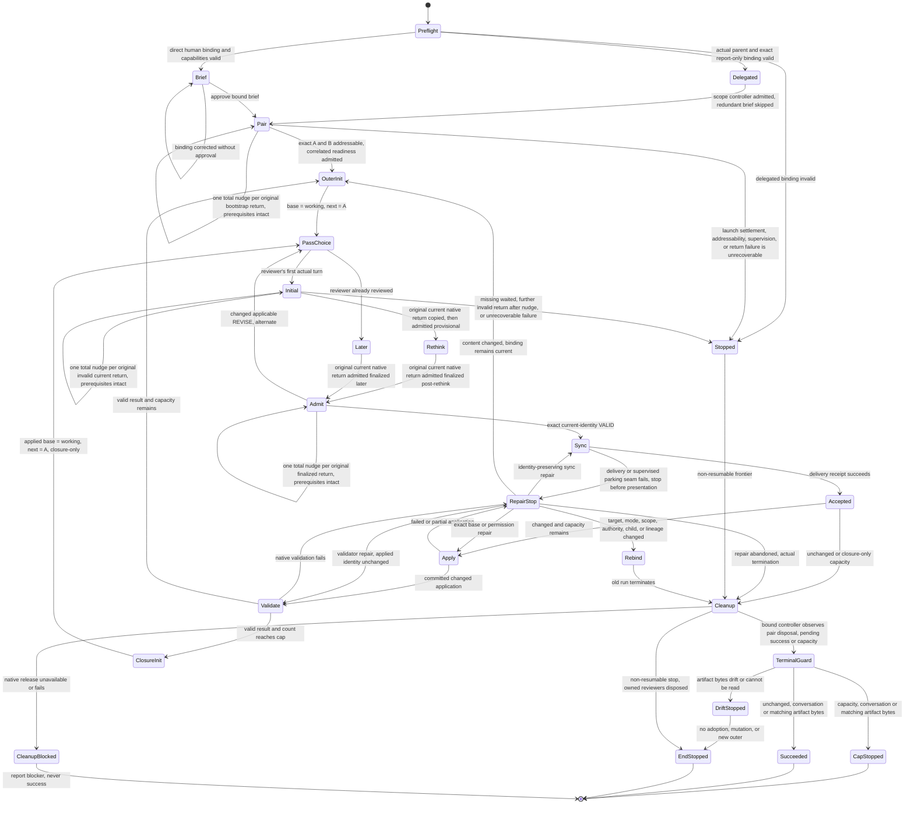

# Reconcile execution flow

This is a non-runtime, non-normative human maintenance map. Ordinary Reconcile
invocation and execution never load or interpret it. `../SKILL.md` and
`reviewer-protocol.md` are the executable owners and win on mismatch.

**Non-runtime diagram caption.** Direction-changing controller branches from
approval through convergence, capacity, stops, and repair.

**Non-runtime table caption.** the controller's action and mutation boundary at each guard.

| Event or guard | the controller action | Canonical mutation allowed |
|---|---|---|
| Static preflight passes and direct brief is approved or exact delegated binding admitted | For direct entry require the human brief; delegated entry verifies actual parent origin and exact scope/report-only authorization and skips only that brief/approval. Before dispatch establish configured distinct roles, native sender/recipient/token/relay facts, readable candidate and authority, scope/mode/targets/cap, and an existing external owner that observes the concrete operation, process state and log cursor every five minutes. After approval allocate A and B, settle both launch-only turns locally, bind their exact current roster ownership, and issue separate correlated readiness requests; launch output is never readiness | No |
| Outer initialization | Set canonical candidate as immutable base and initial working proposal; start with A | No |
| Reviewer's first actual turn | Every expected report uses its original owner-child awaited send with explicit `await: true`, `timeoutMs: 0` and a fresh token; different children may collect concurrently with one outstanding request per pair. Inspect operation errors, requested-recipient delivery, details and waited presence before body access. Copy the complete original current `details.waited` object and exact returned body before decoding, then apply exact child/controller/current-token/relay, role/pass/candidate, grammar, authority and one-time consumption checks. Admit initial provisionally and request one explicit same-child `skill://rethink` for finalized post-rethink. A valid report proves no terminal turn success | No |
| Missing sender/recipient/token or `details.waited`; unrelated message | Preserve the exact pending child, receiving owner, token, phase, identity, delivery facts and used or unknown allowances. Stop the affected request without lookup, inbox, transcript, event, history, RPC-message or agent-output salvage; no redispatch, replay, re-emission, replacement collector, actor replacement, allowance reset or semantic nudge for absence. Foreign, stale-token, duplicate, ordinary output, automatic relay and ignored echo have no authority. Unrelated input leaves the legitimate expectation pending | No |
| Present current return before semantic handling | Mechanically preserve the complete original waited object and exact stock-returned body before decode or unrelated work. If owner copying fails, retain successful delivery history but block admission. Apply every normal native and workflow check to that exact body; never reconstruct stock-trimmed edges | No |
| Invocation-local lifecycle slot retention | The actual owner keeps each complete original launch-settlement, pre-readiness roster-binding, operation/phase return and exact disposal observation in a distinct slot across subsequent sends through final assembly and cleanup. Later native objects, snapshots, copied payloads, equal hashes or matching child IDs cannot overwrite, relabel or backfill an earlier slot; absence remains unresolved without salvage. These lifecycle slots are not Retrace capacity slots and end with the run | No |
| Correctable invalid expected return, nudge unused | With approved run binding, retained child, and required channel intact, spend the one total allowance across delivery, format, and identity for a present attempted current return. Restate the violation, request one complete IRC report using a fresh authored token, retire the old token without resetting the allowance, and revalidate native sender/recipient, token and full grammar. Use observed delivery facts, never the ignored echo | No |
| Corrected return is valid | Continue with inherited authority: bootstrap stays bootstrap, initial stays provisional, finalized response follows normal verdict handling; no new child, review, or rethink | No |
| Further invalid return after the nudge | Stop and clean up even if the defect category changes or the return is duplicated; correction never creates another allowance or permits normalization, unwrapping, deduplication, or last-block selection | No |
| Valid REVISE/BLOCKED, ignored echo, context-only sync, or separately authorized repair | Keep each existing path, including once-approved-context correction; none consumes or replenishes the original return's malformed-return allowance | Only under the existing acceptance and repair rules |
| Eligible failure of an already-authorized invocation, collection, synchronization, or validator mechanism | The responsible execution owner follows the explicitly adopted sole generic recovery policy for the same operation and unchanged semantic request. Supported observation is continuation; correction spends only the matching machinery allowance and never replays reviewer work, changes token/pass, refunds a return nudge, or overrides a valid verdict, stop, provenance requirement, or cleanup | No |
| Reviewer has already reviewed | Request finalized later pass without rethink | No |
| Changed applicable REVISE | Replace ephemeral working proposal and alternate to the counterpart | No |
| Exact current-identity VALID | Synchronize the already-live counterpart | No |
| Synchronization receipt fails | Stop at the exact working identity | No |
| Synchronized working proposal equals outer base | Silently dispose the pair, then in artifact mode freshly compare canonical bytes to reviewed base immediately before unchanged success | No |
| Synchronized proposal changed and capacity remains | Apply once, re-identify, validate, and begin a new A-led outer | Once, after synchronization |
| A committed application reaches the cap | Begin one closure-only outer from the applied base | No further mutation |
| Closure accepts another changed proposal | Synchronize and dispose the pair, then freshly identify artifact bytes if applicable immediately before `CAP_REACHED` reporting with canonical and pending identities | No |
| Terminal artifact freshness finds drift or unreadable bytes | The pair is already disposed; stop without adoption or a fresh review loop and report reviewed and observed identities or the read error | No |
| Revoked/conflicting approved binding, lost child, or actually unavailable required seam; other liveness/stop guard | Stop at the exact frontier without spending an unused nudge to bypass the failure; do not infer this loss merely from an invalid returned message. Dispose the pair if non-resumable | No |
| Application or validation fails | Stop on observed bytes and request one exact repair authority | No automatic mutation or rollback |
| Explicit repair preserves every bound content identity | Verify identity and retry only the failed sync, apply, or validation step | Only the already-accepted exact apply retry |
| Repair changes content while the binding remains current | Invalidate VALID and begin a fresh A-led outer | No until freshly accepted and synchronized |
| Target, mode, scope, authority, child binding, or lineage changes | Require a revised Reconcile binding | No |
| Further outer or eligible identity-preserving repair pause | Retain the same pair. On OMP, the counterpart performs only the adapter's exact no-prose controller-bound `timeoutMs: 0` parking wait under the already-bound external owner; the controller consumes only the synchronization receipt. Delivery does not guarantee waiter survival or disposal | No |
| Actual termination, including abandoned repair pause | Follow the native adapter to dispose both exact owned reviewer IDs, including original-job-settled children; the controller retains each complete original terminal non-running or removal observation in that reviewer's distinct disposal slot before final assembly. No new reviewer message, later roster snapshot, cancellation receipt, job-scoped handle or matching ID/hash substitutes for that evidence | No |
| Silent cleanup unavailable or failed | Report unresolved owned IDs and capability blocker; never success or a falsely completed capacity stop | No |

Behavior-changing maintenance updates the owning executable prose, every affected
diagram edge or table row, and at least one semantic eval in the same change.
Presentation-only wording does not require a map edit. A mismatch is an edit-time
documentation defect, never a live controller stop.
