# Reconcile execution flow

This is a non-runtime, non-normative human maintenance map. Ordinary Reconcile
invocation and execution never load or interpret it. `../SKILL.md` and
`reviewer-protocol.md` are the executable owners and win on mismatch.

**Non-runtime diagram caption.** Direction-changing controller branches from
approval through convergence, capacity, stops, and repair.

```mermaid
stateDiagram-v2
    [*] --> Preflight
    Preflight --> Brief: capabilities and binding valid
    Brief --> Brief: binding corrected without approval
    Brief --> Pair: approve bound brief
    Pair --> OuterInit: distinct A and B retained, native readiness lines checked
    Pair --> Pair: one total nudge per original bootstrap return, prerequisites intact
    Pair --> Stopped: further invalid return after nudge, or unrecoverable failure
    OuterInit --> PassChoice: base = working, next = A
    state PassChoice <<choice>>
    PassChoice --> Initial: reviewer's first actual turn
    PassChoice --> Later: reviewer already reviewed
    Initial --> Rethink: native provenance and declared body admitted, provisional initial complete
    Initial --> Initial: one total nudge per original initial return, prerequisites intact
    Initial --> Stopped: further invalid return after nudge, or unrecoverable failure
    Rethink --> Admit: finalized post-rethink
    Later --> Admit: finalized later
    Admit --> Admit: one total nudge per original finalized return, prerequisites intact
    Admit --> PassChoice: changed applicable REVISE, alternate
    Admit --> Sync: exact current-identity VALID
    Admit --> Stopped: further invalid return after nudge, liveness or run-binding stop
    Sync --> RepairStop: delivery fails, stop before presentation
    Sync --> Accepted: delivery receipt succeeds
    state Accepted <<choice>>
    Accepted --> Cleanup: unchanged or closure-only capacity
    Cleanup --> TerminalGuard: pair disposed, pending success or capacity
    TerminalGuard --> DriftStopped: artifact bytes drift or cannot be read
    Accepted --> Apply: changed and capacity remains
    Apply --> RepairStop: failed or partial application
    Apply --> Validate: committed changed application
    Validate --> RepairStop: native validation fails
    Validate --> ClosureInit: valid result and count reaches cap
    Validate --> OuterInit: valid result and capacity remains
    ClosureInit --> PassChoice: applied base = working, next = A, closure-only
    RepairStop --> Sync: identity-preserving sync repair
    RepairStop --> Apply: exact base or permission repair
    RepairStop --> Validate: validator repair, applied identity unchanged
    RepairStop --> OuterInit: content changed, binding remains current
    RepairStop --> Rebind: target, mode, scope, authority, child, or lineage changed
    RepairStop --> Cleanup: repair abandoned, actual termination
    DriftStopped --> EndStopped: no adoption, mutation, or new outer
    Stopped --> Cleanup: non-resumable frontier
    Rebind --> Cleanup: old run terminates
    TerminalGuard --> Succeeded: unchanged, conversation or matching artifact bytes
    TerminalGuard --> CapStopped: capacity, conversation or matching artifact bytes
    Cleanup --> EndStopped: non-resumable stop, owned reviewers disposed
    Cleanup --> CleanupBlocked: native release unavailable or fails
    CapStopped --> [*]
    Succeeded --> [*]
    EndStopped --> [*]
    CleanupBlocked --> [*]: report blocker, never success
```

**Non-runtime table caption.** Main's action and mutation boundary at each guard.

| Event or guard | Main action | Canonical mutation allowed |
|---|---|---|
| Preflight passes and the bound brief is approved | Retain distinct read-only A and B, ignoring local launch output. After binding both native child IDs, send each an IRC readiness request with a unique Main-authored token. Check both role-bound readiness lines against native sender/recipient and replyTo matching the current token before outer one. No native request ID is needed. Awaited and queued reports survive bootstrap-job expiry; no host completion field is required. Bootstrap and initial inputs include no supplemental-skill loading recipe or path | No |
| Outer initialization | Set canonical candidate as immutable base and initial working proposal; start with A | No |
| Reviewer's first actual turn | Match the explicit owner-directed IRC report to the current authored token, exact native child and controller; decode only its unchanged text body, then check role/pass/candidate and consume the token once. Admit provisionally and send one explicit same-child `skill://rethink` follow-up with a fresh token requiring one matching `post-rethink` IRC report. A valid report proves no terminal turn success | No |
| Missing sender/recipient or token-preserving channel capability; unrelated message | Stop for missing native provenance or rejected/stripped token without reviewer repair or a body-grammar fallback. Foreign, stale-token, duplicate, ordinary output, automatic relay and ignored echo have no authority. Unrelated input leaves the legitimate expectation pending without redispatch. Bootstrap-job eviction has no effect | No |
| Correctable invalid expected return, nudge unused | With approved run binding, retained child, and required channel intact, spend the one total allowance across delivery, format, and identity. Restate the violation, request one complete IRC report using a fresh authored token, retire the old token without resetting the allowance, and revalidate native sender/recipient, token and full grammar. Use observed delivery facts, never the ignored echo | No |
| Corrected return is valid | Continue with inherited authority: bootstrap stays bootstrap, initial stays provisional, finalized response follows normal verdict handling; no new child, review, or rethink | No |
| Further invalid return after the nudge | Stop and clean up even if the defect category changes or the return is duplicated; correction never creates another allowance or permits normalization, unwrapping, deduplication, or last-block selection | No |
| Valid REVISE/BLOCKED, ignored echo, context-only sync, or separately authorized repair | Keep each existing path, including once-approved-context correction; none consumes or replenishes the original return's malformed-return allowance | Only under the existing acceptance and repair rules |
| Reviewer has already reviewed | Request finalized later pass without rethink | No |
| Changed applicable REVISE | Replace ephemeral working proposal and alternate to the counterpart | No |
| Exact current-identity VALID | Synchronize the already-live counterpart | No |
| Synchronization receipt fails | Stop at the exact working identity | No |
| Synchronized working proposal equals outer base | Silently dispose the pair, then in artifact mode freshly compare canonical bytes to reviewed base immediately before unchanged success | No |
| Synchronized proposal changed and capacity remains | Apply once, re-identify, validate, and begin a new A-led outer | Once, after synchronization |
| A committed application reaches the cap | Begin one closure-only outer from the applied base | No further mutation |
| Closure accepts another changed proposal | Synchronize and dispose the pair, then freshly identify artifact bytes if applicable immediately before `CAP_REACHED` reporting with canonical and pending identities | No |
| Terminal artifact freshness finds drift or unreadable bytes | The pair is already disposed; stop without adoption or a fresh review loop and report reviewed and observed identities or the read error | No |
| Revoked/conflicting approved binding, lost child, or actually unavailable required seam; other liveness/stop guard | Stop at the exact frontier without spending an unused nudge to bypass the failure; do not infer this loss merely from an invalid returned message. Dispose the pair if non-resumable | No |
| Application or validation fails | Stop on observed bytes and request one exact repair authority | No automatic mutation or rollback |
| Explicit repair preserves every bound content identity | Verify identity and retry only the failed sync, apply, or validation step | Only the already-accepted exact apply retry |
| Repair changes content while the binding remains current | Invalidate VALID and begin a fresh A-led outer | No until freshly accepted and synchronized |
| Target, mode, scope, authority, child binding, or lineage changes | Require a revised Reconcile binding | No |
| Further outer or eligible identity-preserving repair pause | Retain the same pair, including the counterpart's exact no-prose Main-bound indefinite wait; Main consumes only the sync receipt | No |
| Actual termination, including abandoned repair pause | Native `hub cancel` both exact owned reviewer IDs, including original-job-settled children; observe disposal while Main continues, with no new reviewer message | No |
| Silent cleanup unavailable or failed | Report unresolved owned IDs and capability blocker; never success or a falsely completed capacity stop | No |

Behavior-changing maintenance updates the owning executable prose, every affected
diagram edge or table row, and at least one semantic eval in the same change.
Presentation-only wording does not require a map edit. A mismatch is an edit-time
documentation defect, never a live controller stop.
