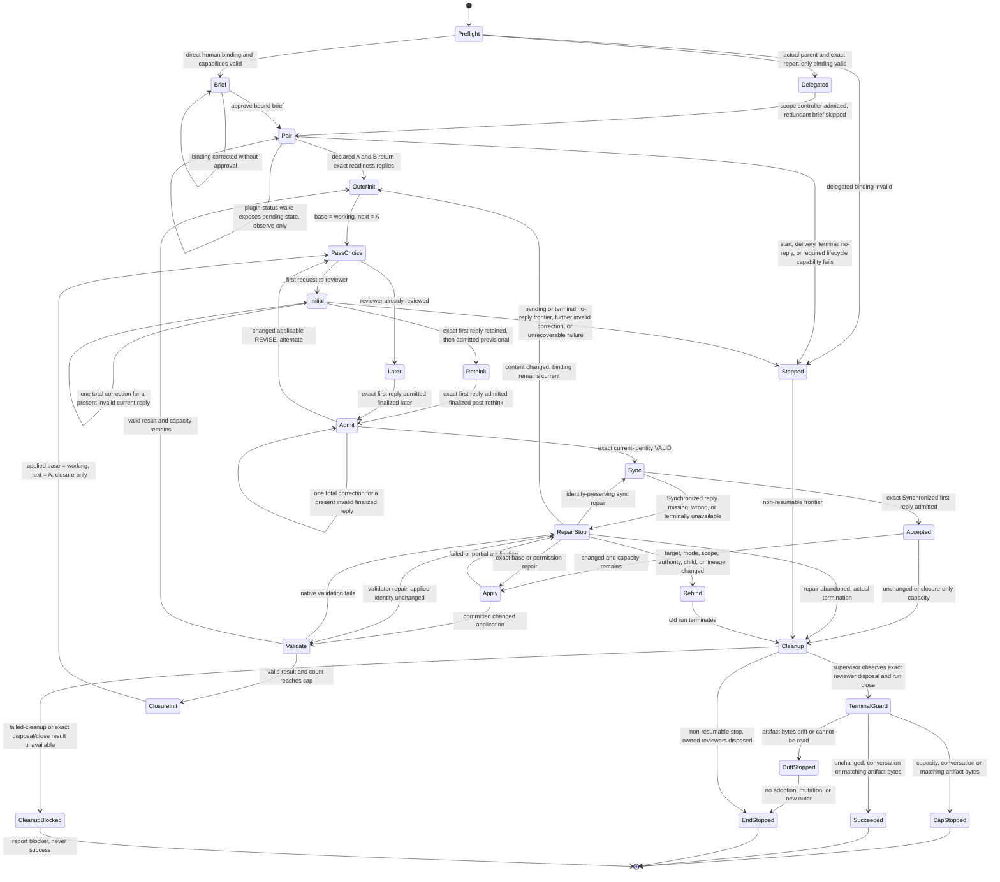

# Reconcile execution flow

This is a non-runtime, non-normative human maintenance map. Ordinary Reconcile
invocation and execution never load or interpret it. `../SKILL.md` and
`reviewer-protocol.md` are the executable owners and win on mismatch.

**Non-runtime diagram caption.** Direction-changing controller branches from
approval through convergence, capacity, stops, and repair.

**Non-runtime table caption.** the controller's action and mutation boundary at each guard.

| Event or guard | the controller action | Canonical mutation allowed |
|---|---|---|
| Static preflight passes and direct brief is approved or exact delegated binding admitted | For direct entry require the human brief; delegated entry verifies actual parent origin and exact scope/report-only authorization and skips only that brief/approval. Before effects validate the named consumer binding, readable candidate and authority, scope/mode/targets/cap, and exact physical owner. Standalone entry opens one named `reconcile` run whose returned stable A/B actor IDs are declared but not launched; delegated entry uses the scope controller's connection-bound lifecycle channel and never opens a second run. Dispatch separate readiness requests and admit only each exact owner-visible `Ready: reviewer <role>` first reply | No |
| Outer initialization | Set canonical candidate as immutable base and initial working proposal; start with A | No |
| Reviewer's first request | Dispatch the exact actor, request ID, semantic phase, and packet; different actors may overlap while each actor has at most one delivered turn. Retain the complete original lifecycle result before body access, then apply exact actor/request/phase/physical-owner, role/pass/candidate, grammar, authority, and one-time consumption checks to the owner-visible first `RequestView.reply.body`. Admit initial provisionally and dispatch one explicit same-A `skill://rethink` follow-up for finalized post-rethink. A valid reply does not prove turn success or reuse | No |
| Missing reply; wrong actor, request, phase, or owner visibility; unrelated input | Preserve the exact request ID, actor, owner, phase, state, delivery facts, and used or unknown allowances. A pending request remains inspectable and explicitly abortable; plugin-owned status wakes authorize observation only. A concrete terminal state without an accepted reply stops the affected operation without task/hub/Eval/yield, lookup, inbox, transcript, history, replay, resend, replacement collector, actor replacement, allowance reset, or semantic correction for absence. Ordinary output and ancestor-redacted state have no authority | No |
| Present current reply before semantic handling | Mechanically retain the complete original lifecycle result before text decode or unrelated work. If owner retention fails, preserve successful delivery history but block admission. Apply every normal lifecycle and workflow check to that exact body; never reconstruct, trim, or normalize it | No |
| Invocation-local lifecycle result retention | The actual owner keeps each complete original open, dispatch, observe, first-reply/turn/reuse, abort, disposal, and close result separately through final assembly and cleanup. Later observations, copied payloads, equal hashes, or matching actor/request IDs cannot overwrite, relabel, or backfill an earlier required result; absence remains unresolved without salvage. Plugin-owned retained results are not Retrace direct-capacity permits and end with the run | No |
| Correctable invalid expected reply, correction unused | With approved run binding, the same stable actor, and required channel intact, spend the one total allowance across delivery, format, and identity only for a present attempted current reply. Restate the violation, dispatch one complete corrective request with a new request ID, and revalidate exact actor/request/phase/owner plus full grammar without resetting the allowance. Plugin status and ordinary output never satisfy the request | No |
| Corrected return is valid | Continue with inherited authority: bootstrap stays bootstrap, initial stays provisional, finalized response follows normal verdict handling; no new child, review, or rethink | No |
| Further invalid return after the nudge | Stop and clean up even if the defect category changes or the return is duplicated; correction never creates another allowance or permits normalization, unwrapping, deduplication, or last-block selection | No |
| Valid REVISE/BLOCKED, ordinary output, context-only synchronization, or separately authorized repair | Keep each existing path, including once-approved-context correction; none consumes or replenishes the original reply's malformed-return allowance | Only under the existing acceptance and repair rules |
| Eligible failure of an already-authorized invocation, collection, synchronization, or validator mechanism | The responsible execution owner follows the explicitly adopted sole generic recovery policy for the same operation and unchanged semantic request. Supported observation is continuation; correction spends only the matching machinery allowance and never replays reviewer work, changes request/phase, refunds a reply correction, or overrides a valid verdict, stop, provenance requirement, or cleanup | No |
| Reviewer has already reviewed | Request finalized later pass without rethink | No |
| Changed applicable REVISE | Replace ephemeral working proposal and alternate to the counterpart | No |
| Exact current-identity VALID | Synchronize the already-live counterpart | No |
| Synchronization receipt fails | Stop at the exact working identity | No |
| Synchronized working proposal equals outer base | Silently dispose the pair, then in artifact mode freshly compare canonical bytes to reviewed base immediately before unchanged success | No |
| Synchronized proposal changed and capacity remains | Apply once, re-identify, validate, and begin a new A-led outer | Once, after synchronization |
| A committed application reaches the cap | Begin one closure-only outer from the applied base | No further mutation |
| Closure accepts another changed proposal | Synchronize and dispose the pair, then freshly identify artifact bytes if applicable immediately before `CAP_REACHED` reporting with canonical and pending identities | No |
| Terminal artifact freshness finds drift or unreadable bytes | The pair is already disposed; stop without adoption or a fresh review loop and report reviewed and observed identities or the read error | No |
| Revoked/conflicting approved binding, lost child, or actually unavailable required seam; other liveness/stop guard | Stop at the exact frontier without spending an unused nudge to bypass the failure; do not infer this loss merely from an invalid returned message. Dispose the pair if non-resumable | No |
| Application or validation fails | Stop on observed bytes and request one exact repair authority | No automatic mutation or rollback |
| Explicit repair preserves every bound content identity | Verify identity and retry only the failed sync, apply, or validation step | Only the already-accepted exact apply retry |
| Repair changes content while the binding remains current | Invalidate VALID and begin a fresh A-led outer | No until freshly accepted and synchronized |
| Target, mode, scope, authority, child binding, or lineage changes | Require a revised Reconcile binding | No |
| Further outer or eligible identity-preserving repair pause | Retain the same pair. Pending lifecycle requests remain inspectable through plugin-owned compact status wakes; only the authorized controller turn or status wake may call `observe`, and explicit owner/user abort changes no semantic allowance. Synchronization acknowledges context only and does not terminate the run | No |
| Actual termination, including abandoned repair pause | A delegated controller calls connection-bound `lifecycle_channel.dispose` for each exact reviewer and waits for `disposed` before publishing `scope-result`. A standalone controller calls public owner-scoped `dispose` for each reviewer, then `close` for remaining run state. Successful cleanup requires supervisor-retained process-exit observation plus exact `disposed`/`closed` results; no reply, turn completion, status wake, abort acknowledgment, signal request, later observation, host teardown, matching ID/hash, or generic cancellation substitutes | No |
| Exact disposal or close unavailable or failed | Preserve `failed-cleanup`, the exact unresolved actor/PID and retained state, and report the blocker; never success or a falsely completed capacity stop | No |

Behavior-changing maintenance updates the owning executable prose, every affected
diagram edge or table row, and at least one semantic eval in the same change.
Presentation-only wording does not require a map edit. A mismatch is an edit-time
documentation defect, never a live controller stop.
